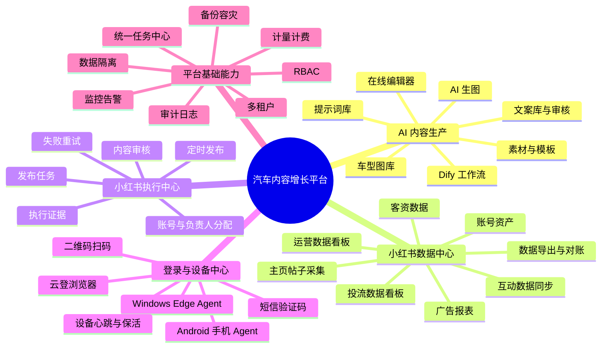

# 2026 年 8 月项目月度总结与产品化规划

文档用途：月度总结、项目复盘、产品化讨论、后续开发立项。

评估日期：2026-08-06。

简明待办总表：[产品化待办简明版.md](./产品化待办简明版.md)

全系统思维导图与任务拆分：[全系统思维导图与产品化任务拆分.md](./全系统思维导图与产品化任务拆分.md)

研发技术细表：[产品化总待办清单.md](./产品化总待办清单.md)

## 一、先说结论

当前项目不是单一的“小红书工具”，而是一套围绕汽车行业内容生产、小红书账号运营、数据分析和自动化执行形成的内部运营平台。

系统已经覆盖四条业务链：

1. 内容生产：提示词、文案、AI 生图、车型图库、素材、模板、编辑器、工作流。
2. 账号运营：小红书账号分配、主页帖子同步、互动数据同步、发布任务和定时任务。
3. 数据分析：运营数据看板、广告投流数据、客资数据、负责人/投手/专业号映射、日报聚合与导出。
4. 执行基础设施：云登浏览器、MCP、Windows、Android 手机、短信验证码、二维码扫码。

但当前形态仍然是“公司内部单组织运营系统”，不是第三方客户可以直接注册、自助接入、自助付费的标准 SaaS。主要差距不在页面数量，而在以下底层能力：

- 没有企业级多租户。
- 权限是角色判断和账号分配，不是完整权限系统。
- 审计只覆盖部分任务，无法完整回放所有操作。
- 小红书采集和发布依赖已登录云登环境、实名手机号和真实手机。
- 自动发布存在平台风控和 UI 自动化稳定性问题。
- 没有按租户计量、成本核算、套餐和账单。
- 没有经过正式容量测试，不能对外承诺并发和 SLA。

因此，最合理的产品化方向不是把全部内部功能原样开放，而是先拆成可以独立售卖的模块，再组合成汽车内容增长平台。

## 二、项目全景思维导图



便于复制到不支持 Mermaid 的文档中的文字版：

```text
汽车内容增长平台
├─ AI 内容生产
│  ├─ 提示词 / 文案 / 生图
│  ├─ 车型图库 / 素材 / 模板 / 编辑器
│  └─ Dify 工作流
├─ 小红书数据中心
│  ├─ 账号主页与帖子采集
│  ├─ 广告投流与客资数据
│  └─ 运营看板 / 投流看板 / 导出对账
├─ 小红书执行中心
│  ├─ 账号分配 / 内容审核
│  └─ 发布 / 定时 / 重试 / 执行证据
├─ 登录与设备中心
│  ├─ 云登环境 / Windows Agent
│  └─ 手机 / 验证码 / 二维码
└─ 商业化基础
   ├─ 多租户 / 隔离 / RBAC / 审计
   ├─ 任务 / 监控 / 备份 / 容灾
   └─ 用量 / 成本 / 套餐 / 账单
```

## 三、当前系统采用什么运行模式

### 1. 当前部署模式

```text
用户浏览器
  -> 公网 IP + HTTP + FRP
云服务器入口
  -> 内网穿透
Windows 主机 Docker
  - Next.js 前端
  - FastAPI 后端
  - Postgres
  - Redis
  - AI Worker
  - 本地 uploads
  -> 云登浏览器 / MCP
  -> 第三方 AI API / 报表 API / 客资 API
```

当前模式的特点：

- Web、数据库、任务、图片和浏览器自动化集中在一台 Windows 主机。
- 云服务器主要承担公网入口和隧道，不是完整控制面。
- 数据库是单组织数据，没有企业租户字段。
- AI 生图和 Dify 主要调用云端接口，不在本机推理。
- 小红书采集和发布依赖云登环境中的登录状态。
- 登录失效时需要手机号验证码或手机扫码恢复。

### 2. 当前用户模式

- 用户由管理员创建，不支持企业自助注册和开通。
- 用户可拥有多个角色。
- 管理员分配小红书账号、广告账号、负责人、投手和工作流。
- 普通用户主要看到自己或所属部门的数据。
- 所有用户本质上仍处于同一个组织和同一个数据库空间。

### 3. 当前自动化模式

- 小红书页面操作主要通过云登浏览器 + MCP/CDP 自动化。
- 手机用于验证码接收和二维码扫码，不是当前主要发布执行端。
- 同一个云登环境有进程内锁，尽量避免同一账号同时执行多个操作。
- 部分任务已经有数据库运行记录，部分任务仍由 Web 进程内异步任务执行。

## 四、现有主要功能与完成度

以下完成度是产品化评估值，不代表代码行数或测试覆盖率。

| 模块 | 当前功能 | 内部使用完成度 | 独立产品成熟度 | 主要缺口 |
|---|---|---:|---:|---|
| AI 生图 | 多 Provider、排队、用户并发限制、历史、失败恢复、去水印 | 70% | 50% | 概率性网络/上游错误尚未闭环；需独立出口、分段监控、幂等核验、熔断切换、对象存储和费用确认 |
| 提示词库 | 分类、示例、图片、分享、举报、审核日志 | 80% | 70% | 企业私有库、版本、权限、引用统计 |
| 文案与审核 | 文案库、导入、采集候选、审核任务 | 65% | 50% | 审批流、版本差异、企业知识库 |
| 素材/模板/编辑器 | 素材、文件夹、模板、Fabric 编辑器、下载 | 70% | 55% | 云存储、协作、历史版本、版权字段 |
| 车型图库 | 品牌车型、车型图片、导入替换、数据库模型 | 75% | 60% | 数据版权、对象存储、版本和去重质量 |
| Dify 工作流 | 工作流配置、授权、任务、SSE、运行日志 | 75% | 60% | 租户隔离、token 计量、凭证加密、稳定队列 |
| 小红书账号管理 | 云登环境同步、账号分配、部门、负责人 | 75% | 45% | 客户自带环境接入、登录生命周期、租户资产隔离 |
| 主页帖子采集 | 全量同步、互动/详情同步、历史批次、失败重跑、多 Runner | 60% | 35% | 账号级水位、原始快照、阶段恢复、增量校准、冲突调度、稳定 Edge Agent 和采集质量 SLA |
| 小红书发布 | 发布、定时、状态、数据回收 | 55% | 25% | 风控、人工确认、挑战处理、执行证据、官方接口 |
| 运营数据看板 | 页面、指标、负责人、帖子、互动、投流占比和客资结构已搭建 | 55% | 25% | 云手机完整采集链路、全账号覆盖、每日增量、失败补采、连续周期对账；当前不能按准确数据产品交付 |
| 投流数据看板 | 账号/投手/专业号映射、聚合、标签、趋势、导出 | 80% | 60% | 当前已有准确数据；下一步补数据源授权、计费、快照版本、异常监控和 SLA |
| 验证码中台 | 双卡映射、activation、短信事件、短期验证码 | 65% | 35% | 多租户、设备归属、HTTPS、隐私与合规 |
| 手机扫码 | 上传二维码、相册识别、脚本配置、唤醒 | 45% | 25% | 设备池、无障碍稳定性、截图证据、客户自持设备 |
| 管理后台 | 用户、多角色、Provider、工作流、任务、使用趋势 | 65% | 40% | 企业管理、配额、账单、全局审计、客服能力 |

## 五、上线产品的八项核心检查

## 1. 多租户配置有没有

### 当前状态

没有真正的多租户。

当前数据库只有用户、角色和业务归属关系，没有以下核心实体：

- 企业/租户。
- 工作区/品牌空间。
- 企业成员关系。
- 租户套餐和配额。
- 业务表统一 `tenant_id`。

因此当前管理员看到的是全局数据，不同客户如果放进同一套系统，只依靠 `user_id` 或账号分配过滤，无法形成可信的企业隔离边界。

### 需要开发

- 新增企业、工作区、企业成员、成员角色。
- 核心业务表增加 `tenant_id`，需要时增加 `workspace_id`。
- API 从登录会话解析租户，禁止前端自行传任意租户 ID。
- 所有唯一约束改为租户内唯一，例如账号、邮箱别名、提示词分类、任务幂等键。
- 管理员拆分为平台管理员和企业管理员。
- 增加跨租户越权自动测试。

### 产品化结论

这是接入第二家独立客户之前必须完成的 P0 能力。

## 2. 数据隔离边界是哪些

### 当前已有边界

| 数据 | 当前隔离方式 | 现状评价 |
|---|---|---|
| 项目 | `user_id` | 用户私有，基础可用 |
| 素材 | `created_by` | 用户私有，管理员全局可见 |
| AI 任务 | `user_id` | 用户私有，管理员可看全局 |
| Dify 任务与日志 | `user_id` | 用户私有，管理员可看全局 |
| 文案 | `user_id` | 以用户为主，部分审核场景共享 |
| 提示词 | 创建者可编辑，社区内容共享 | 属于共享资源，不是企业私有库 |
| 模板/车型库 | 全局共享 | 当前适合公司公共资源 |
| 小红书环境 | 管理员分配给用户，负责人按部门查看 | 是业务授权，不是租户隔离 |
| 小红书帖子 | 发布人和环境归属过滤 | 具备用户边界，但依赖分配正确性 |
| 运营看板 | 管理员、部门负责人、运营分层 | 部门视角已有，企业边界没有 |
| 投流看板 | 管理员/负责人全量，投手看自己 | 投手边界已有，企业边界没有 |
| 上传文件 | `/uploads` 静态 URL | 知道 URL 后可能绕过业务权限 |

### 主要风险

- 缺少租户字段，无法证明两个企业的数据天然隔离。
- 文件访问没有统一鉴权或签名 URL。
- 全局共享的车型、模板、提示词没有“平台公共 / 企业共享 / 用户私有”三级可见性。
- 部分映射依赖账号名称，名称变化可能导致数据归属错误。

### 需要开发

- 建立平台公共、企业共享、用户私有三级数据可见性。
- 文件迁移对象存储，私有资源使用短期签名 URL。
- 账号、专业号、广告账号用稳定 ID 关联，名称只作为展示字段。
- 数据查询统一走租户 Scope，不允许每个接口自行判断。

## 3. RBAC 目前有没有，是几级

### 当前状态

有多角色 RBAC，但属于固定角色、粗粒度实现。

当前共有 7 种角色：

1. `admin`：管理员。
2. `xhs_lead`：小红书部门负责人。
3. `xhs_ops`：小红书运营。
4. `buyer`：小红书投手。
5. `brand_lead`：品牌部门负责人。
6. `brand_ops`：品牌运营。
7. `viewer`：只读/普通用户。

从权限层级看，实际约等于 4 级：

```text
平台管理员
  -> 部门负责人
     -> 运营 / 投手
        -> 只读用户
```

用户可以拥有多个角色，运营看板已经区分小红书部门和品牌部门，投手看板也能限制为本人负责广告账号。

### 当前缺口

- 没有“租户管理员”。
- 没有 `resource + action` 权限点，例如 `report.export`、`account.assign`、`post.publish`。
- 不能创建自定义角色。
- 前后端部分入口仍使用角色名称判断，规则容易分散。
- 账号分配属于数据权限，但没有统一数据权限策略引擎。

### 需要开发

- 采用 RBAC + Data Scope：角色决定能做什么，数据范围决定能看哪些账号。
- 权限点至少拆分查看、创建、编辑、删除、执行、发布、导出、配置、审计。
- 增加平台、租户、工作区、资源四级作用域。
- 管理页面展示“为什么此用户能看到这条数据”。

## 4. 流程是否可审计，日志能否回溯事件

### 当前状态

部分可审计，不能全局回溯。

已经存在的记录：

- AI 生图任务：用户、模型、提示词、参数、状态、结果、错误和耗时。
- Dify 任务/日志：输入、输出、状态、错误和耗时。
- 账号主页同步：同步批次、每个账号状态、参数快照、结果和错误，可重跑失败项。
- 定时任务：任务键、来源、状态、消息和时间。
- 提示词审核：举报、操作人、操作类型和说明。
- 帖子浏览同步：Runner、来源环境和执行事件。

缺少的全局审计：

- 登录成功/失败、会话撤销。
- 用户、角色、负责人、投手和专业号分配变更。
- Provider、Dify、云登、短信设备等密钥配置变更。
- 数据导出、批量下载、批量删除。
- 发布前后的完整证据、页面截图、挑战状态。
- 谁修改了定时任务、并发和日期范围。

### 需要开发

统一 `audit_events`：

```text
tenant_id / actor_user_id / actor_type
action / resource_type / resource_id
before / after / result
request_id / job_id / ip / user_agent
created_at / retention_policy
```

日志要求：

- 业务日志、任务事件和审计日志分开。
- 审计日志不可由普通管理员直接删除或修改。
- 敏感字段脱敏，不能记录明文 token、密码和验证码正文。
- 支持按用户、账号、任务和时间线回放事件。

## 5. 大模型是云端接口还是本地化部署

### 当前状态

当前主要是云端接口调用：

- GPT Image 兼容 Provider：云端图片接口。
- Seedream：火山引擎云端接口。
- MentalOut/chunfeng 等中转 Provider：云端接口。
- Dify：base URL 可配置，可以接云端或自建 Dify，但当前项目本身不负责部署推理模型。
- 内容标签、摘要和部分文案工作流：通过外部模型接口完成。

当前系统没有本地 GPU 推理服务，也没有模型权重、模型调度、显存管理和本地推理监控。

### 能否本地化

可以本地化文本模型和开源图片模型，但不能把 GPT Image、Seedream 这类闭源服务直接搬到本地。若客户要求离线部署，需要更换为可私有化的开源模型，并接受质量和速度差异。

### 本地化硬件建议

| 场景 | 最低试运行 | 建议生产配置 | 说明 |
|---|---|---|---|
| 标签、摘要、普通文案，7B-14B 量化模型 | 1 张 24GB 显存 GPU，64GB 内存，2TB NVMe | 1-2 张 24GB 或 1 张 48GB GPU，128GB 内存，4TB NVMe | 可用 vLLM/兼容 OpenAI API 服务 |
| 复杂文案、32B 量化模型 | 48GB 总显存，128GB 内存 | 80GB GPU 或双 48GB，256GB 内存 | 并发和上下文长度决定显存 |
| 开源图片生成，低并发 | 1 张 24GB GPU，64GB 内存 | 48-80GB 显存节点，128GB 内存，4TB NVMe | 不能保证与当前闭源模型同质量 |
| 文本 + 图片生产环境 | 不建议和数据库、云登共机 | 独立 GPU 推理节点，至少双节点或云端兜底 | 防止 GPU/磁盘任务拖垮业务系统 |

### 建议模式

- 标准 SaaS：云端模型，多 Provider 路由，按用量计费。
- 企业私有化：平台和数据本地化，模型可以选择客户自己的云端 Key 或本地模型。
- 不建议现阶段购买大量 GPU 后再寻找使用场景，先把模型接口和计量抽象做好。

## 6. 并发量，包括 HTTP 和 Socket

### 当前可确认配置

- FastAPI 当前是 1 个 Uvicorn 进程。
- Postgres 连接池 `pool_size=10`，`max_overflow=20`，理论最高 30 个连接，不等于只能支持 30 个 HTTP 用户。
- 前端 API 全局超时高达 900 秒，说明仍有长任务占用 HTTP 请求的历史设计。
- AI Worker 并发配置默认 15。
- 单个用户最多 6 个进行中 AI 生图任务。
- AI Worker 默认每 10 秒启动一个新上游请求，理论启动吞吐上限约 6 个/分钟/Worker。
- 小红书发布默认 Worker 数配置为 2，并且同一云登环境串行锁定。
- 不同同步 Runner 可以并行，同一 Runner/环境内任务串行，避免浏览器互相干扰。
- 内容标签冷计算并发限制为 1，避免把数据库 IO 打满。
- 用户侧实时通信主要是 Dify SSE；没有统一业务 WebSocket 服务。
- 云登浏览器使用内部 CDP WebSocket，这不是面向用户的 Socket 并发。

### 当前不能承诺的内容

项目没有正式压测报告，因此不能对外宣称支持 100、500 或 1000 并发用户。HTTP 是异步的，但看板冷查询、文件下载、云登自动化和第三方接口延迟会决定实际容量。

### 需要完成的压测

分开测试，不使用一个“总并发数”代替：

1. 登录和普通 CRUD：50/100/200 并发。
2. 看板缓存命中和冷查询：20/50 并发筛选。
3. AI 生图：队列 50/100/500 个任务，验证等待时间和供应商限流。
4. Dify SSE：20/50/100 条长连接。
5. 云登：按 Runner 数测试，每个环境保持单任务。
6. 文件：100 个用户同时加载缩略图和 10 个大文件导出。

### 商业化初期建议目标

- 普通 API P95 小于 500ms。
- 默认看板 P95 小于 2 秒，筛选 P95 小于 3 秒。
- 任务创建 P95 小于 300ms，重任务立即入队。
- 首期支持 50 个同时在线用户、20 个并发操作用户。
- AI 和浏览器任务按队列容量承诺，不按 HTTP 并发承诺。

## 7. 数据备份与导出能力

### 当前备份能力

- 已有手动脚本执行 `pg_dump`。
- 已有 uploads 目录压缩备份。
- Docker 数据使用持久卷。

### 当前不足

- 没有确认自动备份计划、保留周期和异地副本。
- 没有数据库时间点恢复能力。
- 没有定期恢复演练记录。
- 本地图片和数据库备份仍可能处于同一台物理机。
- Redis 不是业务真相源，但任务恢复策略尚未统一。

### 当前导出能力

- 小红书广告报表可导出 Excel。
- 投流看板品牌表和笔记表可导出 Excel。
- 车型库可导出 JSON。
- 缺少完整的企业数据包、审计日志和任务证据导出。

### 需要开发

- 每日数据库备份、保留 7/30/180 天策略和异地对象存储。
- 数据库增量/WAL 归档或等价时间点恢复。
- 每月自动恢复演练。
- 企业级一键导出：成员、账号、内容、素材、任务、报表、审计。
- 大导出改为异步任务，完成后提供有时效的下载链接。

## 8. 计量计费，是否能按租户统计 token/调用次数

### 当前状态

未实现商业计量计费。

当前能看到：

- 每个用户 AI 任务数量、成功率和耗时。
- 每个模型调用次数。
- Dify 工作流任务次数、状态和耗时。
- 用户素材存储占用。

当前不能准确统计：

- 租户维度用量，因为没有租户。
- 输入 token、输出 token、缓存 token。
- 每张图片实际供应商成本。
- 工作流内部调用了几次模型、搜索或 OCR。
- 供应商赠送额度、失败退款、重试成本。
- 应收金额、套餐余额和超额费用。

### 需要的数据模型

建立不可变 `usage_events` 和版本化 `rate_cards`：

```text
tenant_id / user_id / request_id / job_id
product / provider / model / operation
input_tokens / output_tokens / cached_tokens
image_count / image_size / duration_seconds / storage_bytes
supplier_cost / billable_amount / currency
rate_card_version / occurred_at
```

计费公式：

```text
文本成本
= 输入 token / 1,000,000 × 输入单价
+ 输出 token / 1,000,000 × 输出单价
+ 缓存 token / 1,000,000 × 缓存单价

图片成本
= 图片数量 × 模型/质量/尺寸对应单价

租户账单
= 模型成本 + 存储 + 自动化任务 + 套餐固定费 - 赠送额度
```

### 费用示例

以下仅展示计算方式，不代表当前供应商合同价格：

- 假设图片综合成本为 0.50 元/张，月生成 10,000 张，模型成本约 5,000 元。
- 假设文本输入 50,000,000 token，输入单价 10 元/百万；输出 10,000,000 token，输出单价 40 元/百万，文本成本约 900 元。
- 再加对象存储、CDN、OCR、工作流、短信和人工运维成本，形成租户毛成本。

正式定价前必须把每家 Provider 的真实合同价格录入费率表，不能用固定估算写死在代码里。

### 建议销售计价方式

- 基础订阅：成员数和基础功能。
- 规模费用：小红书账号、广告账号、设备和 Runner 数量。
- 用量费用：AI 图片、token、工作流、批量采集和存储。
- 企业增值：私有化、专属执行节点、SLA、审计、单点登录和定制数据源。

## 六、小红书数据采集对第三方客户的现实限制

## 1. 为什么内部能用，第三方不能直接用

当前采集需要同时满足：

- 一个有效的云登环境。
- 云登环境中已经登录目标小红书账号，或具备可访问页面的登录状态。
- 登录失效时有该账号对应的手机号或可扫码确认的手机。
- Windows 主机可启动云登浏览器并让 MCP 连接 CDP WebSocket。
- 页面结构没有发生未适配变化。

公司内部可以统一维护这些资产。第三方客户如果只拿到一个网站账号，却没有把自己的小红书环境、手机号和手机接进来，采集链路不会自然成立。

## 2. 第三方接入应该采用哪种模式

### 模式 A：纯内容 SaaS，最适合优先上线

客户使用：

- 提示词库。
- 文案和审核。
- AI 生图。
- 车型图库、素材、模板和编辑器。
- 工作流。
- 手工导入数据后的基础看板。

不提供云登自动采集和自动发布。该模式风险最低、最容易多租户化，也最容易独立收费。

### 模式 B：客户自带账号和 Edge Agent

客户提供并持有：

- 自己的云登环境或浏览器环境。
- 自己的小红书账号。
- 自己的实名手机号和手机。
- 一台可长期在线的 Windows 执行机。

平台提供 Windows Edge Agent。Agent 主动连接平台，只领取该租户任务。浏览器 Cookie 和登录状态保留在客户本地，平台保存账号标识、任务状态和必要结果。

推荐登录流程：

```text
客户安装 Edge Agent
  -> 同步自己的云登环境
  -> 选择目标小红书账号
  -> Agent 检查登录状态
  -> 需要登录时创建二维码/验证码任务
  -> 客户用自己的手机扫码或接收验证码
  -> 登录状态留在客户环境
  -> 平台开始采集授权账号数据
```

这是数据采集产品对外输出时最合理的方式。

### 模式 C：托管运营服务

由公司提供账号托管、手机、云登环境和运营人员。客户购买的是运营服务，不是纯 SaaS。

该模式需要：

- 明确账号和手机号授权。
- 设备、环境和客户一一归属。
- 操作审批、审计和服务协议。
- 人工值守登录挑战和风险提示。

不建议把公司共享手机和验证码池直接开放给不相关第三方使用。

## 3. 采集产品还需要补什么

- Edge Agent 安装、升级、心跳、离线告警和版本管理。
- 客户环境发现、授权、归属和健康检查。
- 登录状态检测和登录任务中心。
- 二维码/验证码由客户本人完成，不由平台共享手机号代收。
- 页面变化检测、截图、HTML/UI 摘要和失败证据。
- 采集速率、时间窗口、失败暂停和人工恢复。
- 数据授权范围、保留期限和删除流程。
- 采集数据与原始来源对账。

## 七、自动发布是否应该改走手机

## 1. 当前浏览器自动发布的问题

- 依赖云登环境和页面结构。
- 页面变化会导致元素定位失败。
- 登录挑战、验证码和二维码会中断任务。
- 高频、机械化操作可能触发平台安全策略。
- 发布成功不等于长期账号安全。
- 当前证据链还不足以完整解释每一步。

## 2. 改成手机自动发布是否就安全

不是。

真实手机可以让设备环境更接近正常用户，但无障碍自动化、固定节奏、批量账号、异常操作路径同样可能触发风险，而且手机 UI 更容易受系统弹窗、版本、分辨率和权限影响。

因此“浏览器自动化换成手机自动化”不能作为解决封号问题的根本方案。

## 3. 推荐产品策略

当前还缺少一条真正完整的业务链：现有 AI 生图、工作流、审核记录和发布能力彼此存在，但尚未形成“工作流内容生产批次 → 标准图文输出 → 机器预审 → 人工审核 → 驳回返工 → 审核版本锁定 → 云手机发布 → 结果回传 → 数据复盘”的统一状态机。因此，不能把现有单点发布能力当作内容生产自动化已经完成。

这里必须明确模块边界：现有 AI 生图继续作为独立创作工具保留，不改入口、不改普通任务流，也不会自动进入审核发布。新增的内容审核与发布功能以已发布工作流为生产引擎，只有用户创建内容生产批次后，工作流的标准输出才会转换为待审核内容项；工作流内部可以按需调用 AI 生图，但这不等于用新功能替代原 AI 生图。

按风险从低到高分三层：

### 第一层：发布助手，优先产品化

- 自动生成标题、正文、标签和图片包。
- 自动做敏感词、长度、图片比例和重复度检查。
- 一键下载或推送到运营人员。
- 运营人员在小红书官方 App 完成最后发布。

### 第二层：半自动发布

- 平台创建任务并打开指定环境。
- 自动填写内容和上传图片。
- 到“确认发布”前暂停。
- 人工确认后继续，保留截图和操作人。

计划中的完整执行链路由平台负责选择并锁定工作流版本、接收标准图文输出、质检、审核和排期；审核通过后，平台调用云手机侧提供的发布 API，由客户自有云手机在小红书官方 App 中执行。云手机需要回传领取、执行、成功、失败、截图、帖子 ID、帖子链接和错误原因，平台再触发发布后数据同步。

### 第三层：全自动发布，仅限明确授权场景

- 优先使用平台正式授权接口，如果存在并且客户具备权限。
- 没有正式接口时，浏览器/手机自动化都作为可选 Edge 能力，不作为 SaaS 默认承诺。
- 每个账号独立队列、速率、时间窗和熔断。
- 遇到验证码、二维码、风控提示和页面异常立即暂停人工处理。

商业化第一阶段建议主推“内容生产 + 发布助手 + 数据分析”，不要把全自动发布作为核心卖点和交付承诺。

## 八、每个模块如何拆成独立产品

| 独立产品 | 核心用户 | 可以先卖什么 | 需要补齐 | 建议顺序 |
|---|---|---|---|---:|
| AI 汽车内容工作台 | 汽车运营、设计、销售 | 生图、文案、提示词、车型图库、模板、工作流 | 多租户、企业知识库、计量、审批 | 1 |
| 小红书数据洞察 | 运营负责人、品牌、投手 | 第一阶段先交付已有准确数据的投流看板；运营看板暂以灰度方式展示 | 云手机运营数据采集、连续对账、租户聚合和授权连接器 | 2 |
| 小红书 Edge 采集器 | 有自有账号和环境的企业 | 客户本地采集、任务历史、失败重跑 | Agent、登录中心、审计、升级 | 3 |
| 小红书发布助手 | 内容运营团队 | 内容包、审核、排期、人工确认发布 | 审批流、证据、挑战处理 | 3 |
| 手机登录与设备中心 | 私有设备运营团队 | 验证码、扫码、设备状态 | 多租户、Windows Agent、隐私、稳定性 | 4 |
| 一体化增长平台 | 中大型汽车营销团队 | 以上模块组合、组织权限、统一数据 | 套餐、SLA、计费、客服、开放 API | 5 |

## 九、未来详细开发点

## A. 产品基础层

- 企业、工作区、成员、多角色和自定义角色。
- 平台公共、企业共享、个人私有三级资源。
- 统一资源权限和数据 Scope。
- 企业开通、邀请、停用、交接和注销。
- 企业品牌配置、Logo、主题和域名。

## B. 统一任务中心

- 统一任务、执行尝试、事件、租约、心跳和死信。
- AI、Dify、采集、发布、报表、聚合、导出统一进入任务中心。
- 支持取消、重试失败项、断点续跑、优先级和限流。
- 任务按租户、用户、账号、设备和 Provider 设并发配额。
- Edge Agent 离线时任务保持等待，恢复后继续。

## C. AI 内容产品

- 提示词版本、变量、适用车型和效果数据。
- 企业私有提示词与平台公共提示词。
- 文案审批、版本差异、引用来源和版权信息。
- Provider 路由、失败切换、质量评分和成本路由。
- Provider 独立出口，避免生产调用依赖服务器系统全局 VPN。
- DNS、TCP、TLS、请求受理、生成轮询和结果下载分段监控。
- 幂等键、上游任务 ID、未知状态核验和重复计费保护。
- Provider × 出口健康评分、熔断、半开恢复和等价路由切换。
- 生图、结果下载、去水印和平台对象存储解耦。
- token、图片、OCR、去水印和存储完整用量事件。
- 生成内容的可追溯来源和 AI 标记策略。

## D. 小红书数据产品

当前产品成熟度必须拆开判断：投流数据面板已经具备当前准确数据，是近期可以继续产品化的主体；运营数据看板目前完成的是页面、指标和部分聚合，准确数据仍依赖云手机采集端完整上线。运营看板只有完成全账号登录与采集覆盖、每日增量、失败补采、互动与客资对账以及连续周期完整性验收后，才可从“数据建设中”切换为正式可用。

- 客户自带数据连接器和 Edge Agent。
- 每个账号独立保存首次全量、增量水位、最近成功、缺失项和失败阶段。
- 主页列表、帖子详情、互动、落库和聚合拆成可恢复阶段，只重跑失败项。
- 原始页面/响应先保存再解析，解析规则修复后支持离线重放。
- 每日增量保留安全重叠窗口，并通过稳定帖子 ID 幂等去重。
- 当天增量、失败补采、历史回填使用不同优先级，避免相互阻塞。
- 账号、专业号、广告账号全部使用稳定 ID 映射。
- 原始层、事实层、聚合层、快照层的数据分层。
- 指标字典、公式版本和数据血缘。
- 缺天、重复、突增突降、映射失败自动告警。
- 数据对账中心和下钻明细。
- 大导出异步化和租户数据包。
- 投流看板固化源报表、事实、聚合和展示四层准确性基线。
- 运营看板建立云手机采集覆盖清单、每日增量、失败补采和上线门禁。

## E. 发布与自动化

- 建立内容任务，把事实来源、参考文案、车型、目标账号、文案、图片和排期串成一条记录。
- 建立机器预审，覆盖敏感词及变体、政策事实、图片 OCR、车型一致性、比例、缺图和版权。
- 建立人工审核、驳回意见、返工版本和审核版本锁定，未审核或审核后被修改的内容不得发布。
- 审核通过后调用云手机发布 API，并支持任务创建、查询、取消、回调、鉴权和幂等。
- Edge 执行截图、DOM/UI 摘要和步骤日志。
- 账号级速率、冷却时间、挑战熔断和人工接管。
- 浏览器与手机执行器统一任务协议。
- 云手机回传执行步骤、截图、帖子 ID、帖子链接和标准化失败原因。
- 发布结果回查后自动同步主页帖子和互动数据，进入内容复盘。
- 将全自动发布标记为高风险可选能力，不作为默认路径。

## F. 设备与登录

- Windows Edge Agent 服务化、自动升级和健康检查。
- 手机 Agent 设备归属、权限、版本、电量和网络状态。
- 验证码 activation 与登录任务关联。
- 二维码任务、超时、截图和人工确认。
- 客户自持手机号和手机，禁止跨租户共享。
- 设备丢失、离线、换卡和账号交接流程。

## G. 商业化与运营

- 套餐、试用期、配额、用量、余额和账单。
- Provider 成本和客户销售费率分开管理。
- 超额提醒、限速、停用和只读策略。
- 客户使用分析、模块转化率和续费风险。
- 工单、状态页、SLA 和客户成功后台。
- 开放 API、Webhook、API Key 和调用审计。
- 客户生命周期不能只做“开通”和“删除”按钮，需要覆盖试用与合同范围、企业初始化、成员权限、资产接入、历史数据初始化、上线验收、日常变更、暂停冻结、退出数据包、保留期、正式删除、备份到期清除和删除证明。

完整设计见 [客户开通运营变更与退出流程.md](./客户开通运营变更与退出流程.md)。

## H. 稳定性、安全与运维

- 数据库自动备份、异地副本和恢复演练。
- 对象存储、CDN、签名 URL 和生命周期。
- API Key 加密、会话撤销、MFA 和登录限速。
- 全局请求 ID、任务 ID、结构化日志和错误聚合。
- API 延迟、慢 SQL、队列、磁盘、证书和第三方接口告警。
- 正式上线前完成域名、HTTPS、Secure Cookie 和公网入口保护。

## 十、建议的产品化推进顺序

### 第一阶段：把内部平台底座做稳

- 统一任务中心。
- 数据质量和对账。
- 对象存储与文件权限。
- 自动备份和监控。
- 清理长 HTTP 请求和进程内任务。
- 完成 AI 生图出口、分段监控、未知状态核验和重复计费保护。
- 完成账号采集水位、原始快照、失败阶段重跑和数据完整性指标。

### 第二阶段：做成可接第二家客户的系统

- 多租户。
- 数据隔离。
- 企业管理员和 RBAC + Data Scope。
- 全局审计。
- 租户级聚合与快照。

### 第三阶段：先上线低风险产品

- AI 汽车内容工作台。
- 企业提示词、文案、素材和工作流。
- 先上线已具备准确数据的投流看板；运营看板保持灰度，等待云手机采集和连续对账验收。
- 发布助手，不承诺全自动发布。
- 用量和成本计量。

### 第四阶段：开放小红书连接能力

- Windows Edge Agent。
- 客户自带云登环境、账号、手机号和手机。
- 登录任务中心。
- 授权数据采集、失败证据和重跑。
- 半自动发布和人工确认。

### 第五阶段：正式商业化

- 域名、HTTPS、公网入口保护。
- 套餐、配额、账单和支付。
- SLA、客服、状态页和企业导出。
- 小范围客户灰度，再逐步扩大账号和设备规模。

## 十一、下个月建议聚焦的交付

不建议下个月同时开发所有模块。建议聚焦以下七个成果：

1. 输出正式产品模块边界和第一期售卖范围，确定先卖“AI 内容工作台 + 数据洞察”。
2. 完成多租户和数据隔离技术设计，包括核心表迁移清单和越权测试矩阵。
3. 完成统一任务中心一期设计，先迁移主页同步、发布和报表刷新。
4. 建立用量事件模型，AI 生图和 Dify 先记录用户、模型、调用量和供应商成本。
5. 完成 AI 生图稳定性第一阶段，能够用证据区分 VPN/代理、上游生成和结果下载问题。
6. 完成账号采集状态与增量补采原型，验证任务中断后只补失败帖子。
7. 完成第三方 Edge 接入原型，验证客户自带云登环境和自己的手机完成一次登录与采集。

账号采集和 AI 生图的专项任务、重试边界与验收场景见 [账号数据采集与AI生图稳定性专项.md](./账号数据采集与AI生图稳定性专项.md)。

月末验收不以“又新增多少页面”为标准，而以以下问题是否能回答为标准：

- 第二家客户的数据能否绝对隔离。
- 任意任务失败后能否定位到具体步骤并安全重试。
- 任意一笔 AI 调用能否知道由谁发起、调用哪个模型、成本是多少。
- 客户能否用自己的账号、环境和手机完成接入，而不依赖公司共享登录资产。
- 哪些功能可以按标准产品交付，哪些仍然属于托管运营服务。

## 十二、汇报时可以直接使用的一段话

本月项目已经从单一 AI 生图工具发展为覆盖内容生产、小红书账号运营、数据分析和自动化执行的一体化内部平台。当前内容生产和数据看板已经具备较强业务价值，但系统仍然以单组织、公司统一设备和云登环境为前提，尚未形成第三方客户可自助接入的 SaaS。下一阶段不再以堆功能为主，而是围绕多租户、数据隔离、RBAC、统一任务、审计、计量计费和客户自带 Edge 执行节点进行产品化。商业化第一步优先输出低风险的 AI 汽车内容工作台和小红书数据洞察，全自动发布暂不作为核心承诺，采用发布助手、人工确认和客户自有设备的渐进方案。
