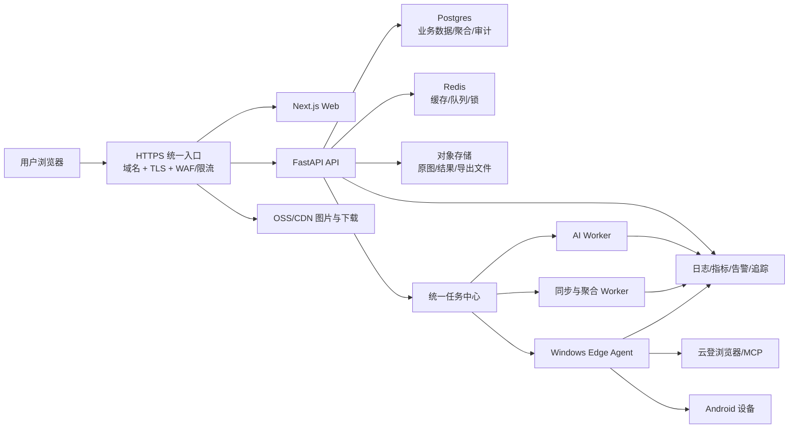

# 商业化上线优化路线图

更新日期：2026-08-06

> 本文作为技术实施附录保留。产品现状、模块拆分、第三方交付模式和月度汇报主文档，以 [2026-08-月度项目总结与产品化规划.md](./2026-08-月度项目总结与产品化规划.md) 为准。

## 1. 目标与原则

当前系统已经具备 AI 生图、素材与车型库、小红书账号运营、自动发布、主页同步、运营看板、投流看板、设备与接码等核心业务能力。下一阶段的重点不是继续堆功能，而是把现有能力改造成可持续交付、可扩容、可审计、可计费的商业化产品。

本路线遵循以下原则：

1. 不重写现有系统，不在稳定性不足时拆微服务。
2. 先建立发布、安全、任务和数据底座，再做多租户与收费能力。
3. Windows 逐步只负责云登浏览器、手机和本地自动化，不长期承载唯一数据库与全部 Web 服务。
4. 所有数据库改造采用“新增兼容字段 -> 回填 -> 双读/双写 -> 校验 -> 收紧约束”的方式，避免一次性破坏线上数据。
5. 每个阶段必须有可量化验收和明确回滚点，未通过验收不进入下一阶段。
6. 域名与 HTTPS 公网切流可以延后，但必须在开放外部客户和启用正式浏览器安全会话之前完成。

## 2. 当前基线

### 已有基础

- 前端：Next.js 15、React、TypeScript。
- 后端：FastAPI、SQLAlchemy、Alembic。
- 数据：Postgres、Redis。
- 异步生图：Redis 队列 + 独立 `ai-worker`，已有幂等和恢复基础。
- 投流看板：已有日级账号、投手、品牌、笔记、内容标签聚合表和看板快照。
- 存储：已有本地、S3/MinIO 适配能力。
- 部署：Windows Docker Compose，公网通过云服务器和 FRP 访问。

### 主要风险

- 公网仍是 HTTP，登录凭证和业务数据缺少传输加密。
- 发布脚本包含固定凭证，发布产物不可追溯，也缺少正式回滚机制。
- 小红书同步、部分工作流和定时任务仍运行在 Web 进程内，重启可能丢任务，多副本可能重复执行。
- Windows 同时承担 Web、数据库、文件、浏览器自动化，磁盘 IO 和休眠会影响全部用户。
- 原图和生成图仍有本地文件依赖，弱网、隧道和白名单问题会造成图片裂开。
- 当前主要是用户级隔离，没有企业、工作区、租户这一层。
- 第三方 API Key 和 token 存储、会话撤销、登录保护、审计能力还不满足商业化要求。
- 代码和数据产物混在同一工作区，大文件较多，缺少完整 CI、监控、告警和恢复演练。

## 3. 目标架构



近期仍可在 Windows 运行 Web/API/Postgres，但接口和任务边界要按目标架构建设。之后迁移控制面时，不需要再次改业务接口。

## 4. 分阶段实施

## 阶段 0：建立可回滚发布基线

建议周期：2-4 个工作日。

### 工作内容

- 盘点并固定当前生产版本、Alembic 版本、Docker 镜像、环境变量和数据卷。
- 把未纳入版本控制但线上依赖的迁移、API、模型和前端页面整理进正式发布分支。
- 将临时数据库、备份、CSV、生成结果、实验项目移出源码目录。
- 删除部署脚本中的固定密码，改为 SSH Key 或 CI Secret。
- 固定 Postgres、Redis、MinIO、Python 和 Node 依赖版本，不继续使用 `latest`。
- 建立最小 CI：前端类型检查和构建、后端测试、Alembic 单头检查、Docker 构建。
- 每次发布生成版本号和变更清单，镜像不可覆盖同一个 tag。
- 上线前自动执行数据库备份；迁移失败时停止发布，不自动启动新代码。

### 验收标准

- 任意线上版本可以定位到唯一 Git commit 和镜像 tag。
- 在一台空白机器上，仅凭发布包和环境配置可以启动系统。
- 30 分钟内可以恢复到上一个应用版本；数据库恢复流程经过一次演练。
- 源码发布包不再包含 `.env`、测试数据库、上传文件和本地备份。

## 阶段 1：统一任务中心与 Windows 执行节点

建议周期：7-12 个工作日。

### 统一任务模型

建立统一 `jobs`/`job_attempts`/`job_events` 模型，至少包含：

- `tenant_id`、`user_id`、任务类型、优先级。
- 状态：等待、已领取、执行中、成功、失败、取消、死信。
- 输入快照、输出摘要、进度、当前步骤。
- 幂等键、重试次数、最大重试次数。
- Worker、租约到期时间、心跳时间。
- 创建、开始、完成时间和关联业务对象。
- 用户可读错误、内部错误、完整日志引用。

### 迁移顺序

1. 保留现有 AI Redis 队列，先统一任务展示和审计字段。
2. 将主页同步、发布、报表刷新、聚合刷新迁到持久任务队列。
3. 将 `asyncio.create_task` 的业务任务移出 FastAPI Web 进程。
4. 将定时任务改为“调度器创建持久任务”，调度器不直接执行重任务。
5. 增加分布式锁/Leader 选举，保证多副本只创建一次定时任务。
6. Windows 安装 Edge Agent，只领取要求云登、MCP、ADB 的任务。

### 必须支持

- 重启后续跑，不因 Docker 或 Web 重启丢失。
- 任务租约超时后自动重新入队。
- 同一业务幂等任务不重复执行。
- 批量任务可并行分片，而不是一个账号一个账号串行。
- 可取消、可重试失败项、可查看每个账号的成功/失败证据。
- Edge Agent 离线时任务保持等待，恢复后继续领取。

### 验收标准

- 重启 backend、worker、Windows 后，运行中任务不会永久丢失或重复落库。
- 100 个账号同步可以按配置并发执行，失败账号可单独重跑。
- Web API 进程不再承担 30 秒以上的业务执行。
- 任务中心能解释“谁、何时、在哪台设备、执行了什么、结果是什么”。

## 阶段 2：数据链路与看板稳定性

建议周期：7-12 个工作日，可与阶段 1 后半段并行。

### 数据分层

```text
第三方原始响应
  -> 原始报表层（保留来源、请求参数、日期和校验值）
  -> 标准事实层（账号、笔记、消耗、互动、线索等统一字段）
  -> 日聚合层（账号/负责人/投手/品牌/笔记/标签）
  -> 看板快照与缓存
  -> 前端展示
```

### 重点改造

- 将 `xhs_report_daily.payload` 的高频字段逐步标准化为可索引列/事实表，不再让看板反复扫描 JSON。
- 延续现有投流日聚合模式，并给运营看板建立同等级聚合表。
- 同步成功后只刷新受影响的日期、账号和报表类型，不做无边界全表刷新。
- 建立数据批次表，记录来源、范围、总行数、成功数、失败数、校验和与聚合版本。
- 建立数据质量规则：缺天、断档、重复、负数、突增突降、映射缺失、汇总不相等。
- 看板读取固定快照版本；新快照完整生成后再原子替换，不展示半成品。
- 默认视图预热，非默认筛选读取聚合并按短 TTL 缓存。
- 大表导出走异步任务和对象存储下载，不占用 Web 请求连接。

### 数据一致性验收

- 每个看板指标都拥有“中文名称、来源、公式、时间口径、负责人映射规则、空值规则”。
- 原始日报合计、日聚合合计、看板合计三层可自动对账。
- 任何一个数字可以下钻到日期、账号、笔记和原始批次。
- 默认看板首屏缓存命中 P95 小于 2 秒，普通筛选 P95 小于 3 秒。
- 频繁切换 20 次筛选，不会把数据库或 Docker 磁盘 IO 打满。

## 阶段 3：对象存储、图片链路与弱网体验

建议周期：4-7 个工作日。

### 工作内容

- 原图、AI 结果、车型图库、二维码、导出文件统一进入 OSS/S3，Windows 本地只保留短期缓存。
- 私有业务文件使用短期签名 URL；公开缩略图使用 CDN。
- 数据库只保存对象 key、尺寸、MIME、hash、所有者和状态，不保存 Windows 绝对路径。
- 上传采用服务端签名后的直传或分片上传，避免大文件经过 FRP 和 FastAPI 二次中转。
- 生成缩略图、WebP/AVIF 预览，列表先加载预览，详情再加载原图。
- 对外部 AI 图片先下载、校验、持久化，再向用户标记任务成功，避免上游临时 URL 失效。
- 图片域名白名单从代码常量改为可审计配置，并限制协议、host、大小和内容类型。

### 验收标准

- Windows C/D 盘清空缓存后，历史图片仍可访问。
- 关闭 FRP 后，已生成图片和历史导出仍可从对象存储访问。
- 弱网下图片列表先显示低清预览，单图失败不阻塞页面交互。
- 对象存储具备生命周期：临时文件自动清理，业务原图按策略归档。

## 阶段 4：多租户、组织和权限

建议周期：10-15 个工作日。

### 核心模型

- `tenants`：客户公司/组织。
- `workspaces`：组织内业务空间或品牌线。
- `memberships`：用户属于哪些组织、在其中拥有哪些角色。
- `roles` + `permissions`：角色和最小权限点。
- 业务表增加 `tenant_id`，需要细分时再增加 `workspace_id`。

### 迁移策略

1. 创建“当前公司”默认租户，把现有数据全部回填到该租户。
2. 新增 nullable `tenant_id` 和索引，旧代码继续工作。
3. 在 API dependency 层统一注入租户上下文，禁止由前端任意传入租户 ID。
4. 新增数据时强制写租户；读取时强制带租户过滤。
5. 编写跨租户越权测试，覆盖下载、图片、导出、任务和后台接口。
6. 数据完整回填后，将关键表 `tenant_id` 改为非空并加复合唯一约束。

### 权限建议

- 平台管理员：管理所有租户和系统配置。
- 企业管理员：管理本企业成员、套餐、账号和设备。
- 部门负责人：查看本部门全量运营或品牌数据。
- 小红书运营：管理被分配的小红书账号。
- 小红书投手：管理被分配的广告账号和投流数据。
- 审核员：只处理审核、发布和驳回。
- 只读用户：查看授权看板和导出。

### 验收标准

- 两个测试租户之间 API、图片、下载、任务和看板数据完全不可见。
- 平台管理员和企业管理员的权限边界清楚且有审计。
- 一个用户可加入多个租户并切换上下文，但不能通过修改请求参数越权。

## 阶段 5：认证、安全与审计

建议周期：5-8 个工作日，可从阶段 0 持续推进。依赖 HTTPS 的 Secure Cookie 强制启用安排在阶段 7 公网切流时完成。

### 工作内容

- 浏览器会话从 `localStorage` 长期 token 迁到 Secure、HttpOnly、SameSite Cookie。
- 增加短 access session、refresh session、设备会话列表、主动撤销和强制下线。
- 管理员支持 MFA；登录增加失败次数限制、IP/账号限速和异常告警。
- 第三方 API Key、广告 token、设备 token 使用 KMS/主密钥信封加密，不明文展示。
- 密钥只允许“替换”和“验证”，默认不允许再次查看完整值。
- 上传文件做 MIME、扩展名、大小、图片解码和恶意文件检查。
- 所有敏感操作写不可变审计日志：登录、角色、账号分配、密钥、导出、发布、删除、重试。
- 日志脱敏手机号、token、Cookie、Authorization 和第三方响应中的敏感字段。
- 建立依赖漏洞扫描、镜像扫描和密钥泄漏扫描。

### 验收标准

- 数据库泄露时无法直接取得第三方明文密钥。
- 用户退出或管理员停用账号后，旧会话立即失效。
- 普通用户无法访问管理员、其他租户、其他用户的文件与导出。
- 高风险操作可以通过审计日志定位到具体操作者和请求。

## 阶段 6：可观测性、容量和容灾

建议周期：5-8 个工作日。

### 可观测性

- 每个请求和任务生成 `request_id/trace_id/job_id` 并贯穿 API、Worker、Edge Agent。
- 指标至少包括：API P50/P95/P99、错误率、数据库连接池、慢 SQL、队列深度、任务等待时间、任务成功率、磁盘、CPU、内存、对象存储错误率。
- 接入错误聚合平台；相同错误去重，保留用户、版本、接口和任务上下文。
- 告警分级：系统不可用、数据延迟、任务积压、磁盘阈值、证书到期、备份失败、第三方接口异常。

### 容量与容灾

- 为容器设置 CPU、内存和日志大小限制，避免单个任务拖垮整机。
- Postgres 自动备份：每日全量 + WAL/PITR 或等价增量能力。
- 对象存储开启版本或跨区复制；Redis 不作为唯一业务事实来源。
- 每月至少执行一次恢复演练，记录 RPO/RTO。
- 商业化初期目标：RPO 不超过 24 小时，RTO 不超过 4 小时；稳定后收紧到 RPO 1 小时、RTO 1 小时。

### 验收标准

- 服务异常时能在 5 分钟内知道是 API、数据库、队列、磁盘、Windows Agent 还是第三方接口问题。
- 模拟 Worker 崩溃、数据库重启、Edge Agent 离线时，系统能恢复且不产生不可解释的重复数据。
- 完成一次从备份恢复到新环境的演练。

## 阶段 7：域名、HTTPS 与公网切流

建议周期：2-4 个工作日。该阶段延后实施，但它是开放外部客户之前的强制上线门禁。

在前面阶段中可以先完成同源 API 路由、应用层登录限速、图片对象存储和安全响应头适配；本阶段只负责正式域名、证书、公网反向代理和流量切换，不再夹带业务重构。

### 推荐入口

- 申请正式域名，例如 `app.example.com`。
- 域名解析到 `47.98.127.132`，由云服务器 Nginx/Caddy 终止 TLS。
- 用户只访问 `https://app.example.com`。
- `/api/`、WebSocket/SSE 和网页使用同源入口，减少 CORS、Cookie 和弱网问题。
- 图片使用 `https://assets.example.com` 或 OSS/CDN 正式域名。

如果短期没有域名，可以先给 IP 配置可用证书作为过渡，但不把 IP 地址入口作为商业化最终方案。国内云服务器绑定域名前，需要同时确认域名备案和云厂商接入要求。

### 入口配置要求

- 80 端口只做 301 跳转到 443。
- 第一周先不上 HSTS，确认所有资源都已 HTTPS 后再开启。
- 代理正确支持 WebSocket、SSE、长轮询和大文件上传。
- 生图、上传和导出的超时分别配置，不使用一个无限大的全局超时。
- 设置请求体大小、连接数、边缘 API 限流和登录接口限速。
- 增加 CSP、`X-Content-Type-Options`、`Referrer-Policy`、Frame 限制等响应头。
- 证书自动续期，并在到期前 14 天告警。
- 后端 `/docs` 和 `/openapi.json` 在生产环境关闭或仅管理员/VPN 可访问。
- CORS 收紧到正式域名，不继续允许任意局域网来源。

### 上线顺序

1. 新域名先接测试入口，不改现有 HTTP 地址。
2. 验证登录、图片、AI 生图、任务轮询、文件上传、导出、WebSocket/SSE。
3. 启用 Secure/HttpOnly 会话，验证登录、续期、退出和强制下线。
4. 让内部用户试运行 1-2 天。
5. 正式入口切到 HTTPS，HTTP 保留跳转和短期回退能力。

### 验收标准

- 浏览器无混合内容、证书、CORS 和 Cookie 警告。
- 登录凭证、API 请求、图片和下载全链路 HTTPS。
- 证书续期模拟测试通过。
- 弱网下刷新页面不会因为某一张图失败导致整页不可用。

## 阶段 8：商业化产品能力

建议周期：10-20 个工作日。

### 产品能力

- 套餐：团队版、增长版、企业版。
- 配额：成员、账号、广告账号、设备、存储、AI 并发、月度 AI 用量、自动化任务量。
- 用量台账：每次 AI 调用、工作流、导出、存储、发布和自动化任务都有可计费记录。
- 套餐变更、超额策略、试用期、停用后的只读与数据导出规则。
- 企业开通向导：组织 -> 成员 -> 小红书账号 -> 广告账号 -> 投手/运营分配 -> 数据同步 -> 看板校验。
- 客户可见的服务状态、任务历史、用量和账单。
- 数据导入/导出、客户注销、数据保留和删除流程。

### 计费建议

- 基础订阅：包含基础成员和少量账号。
- 规模计费：小红书账号、广告账号、设备数量。
- 用量计费：AI 生图、模型成本、存储和大批量自动化。
- 企业附加：私有化部署、专属 Edge Agent、SLA、审计、单点登录、定制数据源。

商业化初期不建议按页面或单一功能收费，应该围绕“团队席位 + 管理规模 + AI/自动化用量”计价。

## 5. 推荐执行顺序

```text
第 1 周：发布基线、备份恢复、密钥清理
第 2-3 周：统一任务中心一期、同步/发布任务持久化
第 3-4 周：运营看板聚合、数据质量与对账中心
第 4-5 周：OSS/CDN、图片与导出迁移
第 5-7 周：多租户一期、企业成员与权限
第 7-8 周：认证、密钥加密、审计、监控与容灾
第 9 周：域名、HTTPS、Secure Cookie 与公网切流
第 10-12 周：套餐、配额、用量、客户开通流程
```

阶段可以局部并行，但以下依赖不能颠倒：

- 没有发布基线和备份，不做大规模数据库迁移。
- 没有 HTTPS，可以继续内部优化和内测，但不开放外部客户账号。
- 没有统一任务中心，不扩大自动化并发和设备数量。
- 没有租户隔离与越权测试，不接入第二家客户。
- 没有用量台账，不正式收费。

## 6. 第一批具体任务

第一批只做基础设施，不改业务口径：

1. 创建生产版本清单和数据库/文件备份清单。
2. 整理 Alembic 迁移并确认生产唯一 head。
3. 清理部署脚本中的固定密码，改 SSH Key。
4. 固定 Docker 镜像版本并增加容器资源与日志限制。
5. 盘点 Web 进程内的长任务和定时任务，确定第一批任务中心迁移清单。
6. 提前完成同源 API 路由适配、应用层登录限速和敏感日志脱敏。
7. 增加基础监控：接口错误率、Postgres 慢查询、Redis 队列、磁盘和任务积压。
8. 对登录、生图、主页同步、发布、两个看板、图片和导出建立自动冒烟测试。

完成这 8 项后开始统一任务中心，不直接同时修改多租户和看板统计口径。域名和 HTTPS 在任务、数据、存储、安全与监控底座稳定后再切换。

## 7. 决策记录

### 暂时不做

- 不立即拆分几十个微服务。
- 不立即迁走全部 Windows 服务。
- 不用 Kubernetes 解决当前单机稳定性问题。
- 不把 Redis 当永久任务记录数据库。
- 不用扩大服务器配置代替慢查询、任务和存储治理。

### 近期必须确定

- 正式产品名称和主域名。
- 第一批客户是否同一家公司；这决定多租户上线最晚时间。
- 图片使用阿里云 OSS 还是兼容 S3 的对象存储。
- 允许的业务 RPO/RTO 和数据保留期限。
- Windows Edge Agent 是客户本地部署还是公司统一设备池。

## 8. 阶段门禁

每个阶段上线前都需要通过以下门禁：

- 代码评审和自动测试通过。
- 数据库迁移已在生产副本演练。
- 生产备份可用且已记录恢复点。
- 冒烟测试覆盖登录、核心任务、图片、看板和导出。
- 有监控指标和失败告警。
- 有明确回滚命令、回滚负责人和允许回滚的时间窗口。
- 上线后观察期内没有错误率、延迟、队列或磁盘异常，再关闭旧版本回退入口。
