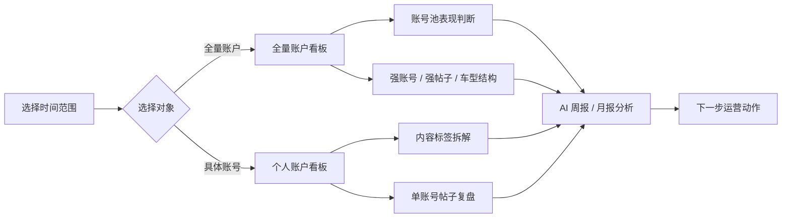

# 小红书运营数据看板功能说明

> 面向已经了解小红书账号运营、笔记发布、车型内容和周/月复盘业务的同学。本文重点说明看板能做什么、每个模块解决什么问题，以及运营应该如何使用。

## 一页总览

小红书运营数据看板由三类能力组成：

| 能力模块 | 主要用途 | 典型使用场景 |
| --- | --- | --- |
| 全量账户看板 | 观察整个账号池表现，判断账号矩阵是否健康 | 周会前快速看整体盘面、找强账号、找强帖子、看车型结构 |
| 个人账户看板 | 拆解单个账号的内容结构和可复刻经验 | 账号负责人复盘单账号，判断下一步写什么、怎么写 |
| AI 运营分析 | 将数据结果转成运营结论和行动建议 | 生成全量/个人的周报、月报结论，辅助排期和复盘 |

核心判断逻辑：

## 1. 通用筛选区

看板顶部是所有模块共用的筛选入口。

| 功能 | 说明 | 影响范围 |
| --- | --- | --- |
| 时间范围 | 选择分析开始日期和结束日期 | 影响 KPI、趋势、排行、个人账号分析 |
| 搜索账号 | 快速定位账号 | 影响账号下拉和全量车型统计筛选 |
| 账号选择 | 选择 `全量账户` 或具体账号 | 决定进入全量看板还是个人看板 |
| 查看摘要 | 跳转到右侧 AI 运营分析 | 帮助快速查看结论和建议 |

时间筛选是整个看板的核心入口。运营可以按一周、一个月，也可以按自定义时间段查看数据表现。

## 2. 顶部核心指标

顶部 KPI 用于快速判断当前样本周期是否正常。

| 指标 | 含义 | 运营判断 |
| --- | --- | --- |
| 活跃账号 | 当前时间范围内有发帖样本的账号数量 | 判断账号池是否正常运转 |
| 发帖数 | 当前时间范围内发布的笔记数量 | 判断发布节奏是否稳定 |
| 总浏览 | 当前时间范围内所有笔记浏览量总和 | 判断整体曝光能力 |
| 总评论 | 当前时间范围内所有笔记评论数总和 | 判断内容是否带来咨询或讨论 |
| 优质帖子数量 | 浏览或评论达到高信号标准的帖子数量 | 判断可复刻样本数量 |
| 低质帖子数量 | 浏览和评论都偏低的帖子数量 | 判断无效内容占比 |

每个指标卡片中都有小趋势线。小趋势线来自真实样本聚合，不是装饰，用于判断指标是集中爆发、稳定增长，还是明显回落。

## 3. 全量账户看板

全量账户看板关注的是账号池整体，不重点拆单个账号的内容细节。

它主要回答三个问题：

| 问题 | 对应模块 |
| --- | --- |
| 账号池里谁表现最好？ | 账号排行 |
| 哪些帖子值得重点复盘？ | 帖子排行 |
| 本月哪类车型内容贡献更大？ | 本月汽车类型统计 |
| 整体数据节奏是否正常？ | 时间趋势 |

### 3.1 账号排行

账号排行用于比较账号池内不同账号的整体表现。

展示内容：

| 字段 | 说明 |
| --- | --- |
| 账号名称 | 当前参与统计的账号 |
| 发帖数量 | 该账号当前周期内的发帖数 |
| 平均浏览 | 该账号当前周期内单篇平均浏览 |
| 综合表现分 | 根据浏览、评论、互动、发帖量和强弱信号计算 |
| 排名进度条 | 直观展示账号之间的差距 |

运营用途：

- 找出可以继续增加排期的强账号。
- 发现近期表现变弱的账号，排查选题、标题、封面或发布时间。
- 找到可以作为其他账号参考的样本账号。

> 注意：账号排行不是平台官方排名，而是运营看板内部的参考排序。

### 3.2 帖子排行

帖子排行用于从全量账号池中找出表现最好的单篇内容。

展示内容：

| 字段 | 说明 |
| --- | --- |
| 帖子标题 | 当前周期内进入排行的笔记标题 |
| 所属账号 | 该帖子发布账号 |
| 浏览量 | 单篇帖子浏览量 |
| 评论数 | 单篇帖子评论数 |
| 综合表现排序 | 根据浏览、评论和互动计算 |

运营用途：

- 快速找出本周期最值得拆解的爆文。
- 判断高表现来自哪个账号、哪个车型、哪个标题结构。
- 为后续内容生产提供参考样本。

### 3.3 本月汽车类型统计

本月汽车类型统计用于观察账号池本月主要覆盖了哪些车型类型，以及不同类型带来的数据表现。

展示内容：

| 图表 / 表格 | 说明 |
| --- | --- |
| 车型类型占比图 | 查看不同车型类型的样本占比 |
| 车型类型数据表 | 查看每类车型的样本数、浏览、评论、互动和平均浏览 |

运营用途：

- 判断本月内容是否过度集中在某一类车型。
- 判断哪些车型类型更容易拿到浏览或评论。
- 判断下一个周期是否需要增加某类车型样本。
- 判断车型内容结构是否和业务主推方向一致。

### 3.4 时间趋势

时间趋势用于观察当前时间范围内账号池整体的每日表现。

图表结构：

| 元素 | 含义 |
| --- | --- |
| 柱状图 | 浏览量 |
| 实线 | 评论数 |
| 虚线 | 发帖数 |
| 左侧纵轴 | 浏览量刻度 |
| 右侧纵轴 | 评论数 / 发帖数刻度 |
| 横向虚线 | 辅助判断趋势高度 |

运营用途：

- 判断哪一天流量明显上升或下降。
- 判断发帖增加是否带来了浏览增长。
- 判断评论高峰是否和浏览高峰同步。
- 判断是否存在发帖多但反馈弱的日期。

鼠标悬停到图表上时，可以查看当天的浏览、评论、发帖和互动数据。

## 4. 个人账户看板

个人账户看板用于分析单个账号。它和全量账户看板的目标不同。

全量看板看的是“账号池怎么分配资源”，个人看板看的是“这个账号怎么优化内容”。

个人账户看板主要回答四个问题：

| 问题 | 对应模块 |
| --- | --- |
| 这个账号最近表现怎么样？ | 顶部 KPI、个人时间趋势 |
| 这个账号主要写哪些内容标签？ | 内容标签图谱 |
| 哪类车型内容更适合这个账号？ | 汽车分布 |
| 哪些帖子值得复盘或复刻？ | 账号帖子排行 |

### 4.1 内容标签图谱

内容标签图谱是个人账户看板的核心模块，用于展示该账号的内容结构。

图谱包含六类标签：

| 标签维度 | 示例 | 关注点 |
| --- | --- | --- |
| 决策主题 | 选车对比、风险避坑 | 用户为什么要看这篇内容 |
| 购车场景 | 首购入门、换购升级、家庭用车 | 内容对应什么购车需求 |
| 标题钩子 | 风险提醒型、价格情报型、政策提醒型 | 标题靠什么吸引点击 |
| 证据结构 | 案例证明、清单拆解、情报先抛 | 正文如何建立可信度 |
| 承接动作 | 后续咨询承接、试驾邀约、无明确动作 | 内容是否把用户导向下一步 |
| 车型锚点 | 具体车型或车系 | 内容围绕什么车展开 |

运营用途：

- 判断当前账号是否已经形成稳定内容结构。
- 找出反复出现且能带来有效互动的内容标签。
- 判断哪些标签只是偶发，不适合直接放大。
- 发现账号是否存在内容分散、主题不聚焦的问题。
- 为后续控变量复刻提供方向。

### 4.2 汽车分布

汽车分布用于查看该账号在当前时间范围内写了哪些车型类型。

展示内容：

| 图表 / 表格 | 说明 |
| --- | --- |
| 车型类型占比图 | 查看该账号当前周期车型分布 |
| 车型类型表现表 | 查看各类型车型带来的浏览、评论和互动 |

运营用途：

- 判断该账号是否过度依赖某一类车型。
- 找出该账号更容易拿到浏览的车型类型。
- 发现发得多但互动弱的车型方向。
- 判断后续选题是否需要补充车型覆盖。

### 4.3 个人时间趋势

个人时间趋势用于观察单个账号在当前时间范围内的每日表现。

图表结构和全量账户时间趋势一致：

| 元素 | 含义 |
| --- | --- |
| 柱状图 | 浏览量 |
| 实线 | 评论数 |
| 虚线 | 发帖数 |
| 左右双纵轴 | 区分浏览量和评论/发帖量级 |
| 鼠标悬停 | 查看当天具体数据 |

运营用途：

- 判断该账号哪一天的内容表现最好。
- 判断发帖节奏是否稳定。
- 判断是否出现发帖多但浏览低的情况。
- 判断评论高峰是否来自个别爆款。

### 4.4 账号帖子排行

账号帖子排行展示当前账号在所选时间范围内表现最好的帖子，并展示封面缩略图。

展示内容：

| 字段 | 说明 |
| --- | --- |
| 排名 | 单账号内帖子表现排序 |
| 帖子封面 | 帮助快速识别内容样式 |
| 帖子标题 | 展示内容主题和标题结构 |
| 浏览量 | 判断曝光表现 |
| 评论数 | 判断咨询和讨论表现 |
| 互动量 | 判断点赞、收藏和分享表现 |

运营用途：

- 快速定位该账号的强内容。
- 复盘标题、封面、车型、开头和评论承接。
- 找出可以继续做同主题、同车型、同结构复刻的帖子。

如果帖子有原帖链接，点击卡片可以跳转到原帖。

## 5. AI 运营分析

AI 运营分析位于看板右侧，用于把图表数据转成运营结论和下一步动作。

图表负责展示事实，AI 分析负责解释事实。

AI 运营分析有两个维度：

| 维度 | 类型 |
| --- | --- |
| 分析对象 | 全量账户、个人账户 |
| 分析周期 | 周报、月报 |

因此完整能力拆成四类：

| 分析类型 | 主要解决的问题 | 适用场景 |
| --- | --- | --- |
| 全量账户周报分析 | 本周账号池表现如何，下周资源怎么分配 | 每周运营例会 |
| 全量账户月报分析 | 本月账号矩阵和车型结构是否健康 | 月度复盘和下月规划 |
| 个人账户周报分析 | 单账号本周发帖和内容表现如何 | 账号负责人周度调整 |
| 个人账户月报分析 | 单账号本月内容定位和可复刻打法是什么 | 账号月度复盘 |

### 5.1 全量账户周报分析

用于复盘账号池最近一周的运营表现。

重点关注：

- 本周账号池整体发帖是否稳定。
- 哪些账号本周表现靠前。
- 哪些帖子是本周强内容。
- 浏览和评论是否集中在少数日期。
- 是否存在低质内容占比上升。
- 下一周应该优先放大哪些账号或题材。

输出价值：

- 决定下周账号排期优先级。
- 决定哪些账号继续加量，哪些账号先观察。
- 找到本周可复刻的帖子结构。

### 5.2 全量账户月报分析

用于观察账号池一个月内的结构性表现。

重点关注：

- 本月账号池整体增长情况。
- 哪些账号长期稳定，哪些账号波动较大。
- 哪些车型类型贡献了主要浏览或评论。
- 哪些内容路线可以沉淀为下月模板。
- 哪些账号或题材需要减少投入。

输出价值：

- 制定下个月账号矩阵策略。
- 制定下个月车型内容策略。
- 沉淀可复制的内容路线。

### 5.3 个人账户周报分析

用于复盘单个账号最近一周的内容表现。

重点关注：

- 该账号本周发帖节奏是否正常。
- 哪几篇帖子表现最好。
- 哪些内容标签带来了更好的浏览或评论。
- 是否存在某天发帖但数据明显偏弱。
- 下周这个账号应该继续写什么、减少什么。

输出价值：

- 指导账号下周选题。
- 调整发布时间和发帖节奏。
- 找到短周期内最值得复刻的内容样本。

### 5.4 个人账户月报分析

用于总结单个账号一个月内的内容方向。

重点关注：

- 这个账号本月是否形成稳定内容定位。
- 哪些车型和标签最适合这个账号。
- 哪些标题结构、证据结构、承接动作更有效。
- 哪些帖子可以作为下月复刻样本。
- 账号是否需要调整主推车型、内容风格或评论承接策略。

输出价值：

- 沉淀账号打法。
- 明确下月主推方向。
- 判断账号是否需要重新定位。

## 6. 数据口径说明

| 指标 | 口径 |
| --- | --- |
| 浏览 | 笔记浏览量 |
| 评论 | 笔记评论数 |
| 互动 | 点赞 + 收藏 + 分享 |
| 发帖数 | 当前时间范围内的笔记数量 |
| 优质帖子 | 浏览量较高或评论数较高的帖子 |
| 低质帖子 | 浏览和评论都明显偏低的帖子 |

当前优质和低质阈值是运营参考口径，不代表平台官方标准。后续可以根据业务阶段调整。

## 7. 推荐使用路径

建议运营按下面路径使用：

| 步骤 | 操作 | 目的 |
| --- | --- | --- |
| 1 | 选择时间范围 | 明确本次分析周期 |
| 2 | 先看全量账户看板 | 判断账号池整体情况 |
| 3 | 查看账号排行和帖子排行 | 找出强账号和强内容 |
| 4 | 查看本月汽车类型统计 | 判断车型内容结构是否合理 |
| 5 | 进入个人账户看板 | 拆解单账号内容结构 |
| 6 | 查看 AI 周报或月报分析 | 把数据结论转成下一步动作 |

最终目标：

> 全量看板解决“账号池怎么投放资源”的问题；个人账户看板解决“单个账号怎么优化内容”的问题；AI 运营分析解决“下一步怎么做”的问题。

