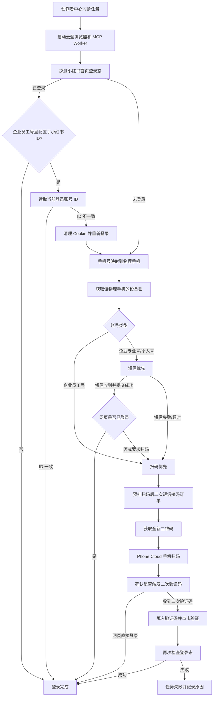

# 小红书创作者中心自动登录全流程

> 文档版本：2026-09-07
> 适用项目：`web`、`xiaohongshu-mcp-patched`、`phone-cloud-platform`
> 目的：说明创作者中心同步中的完整自动登录链路、接口调用、账号分支、设备映射、超时、重试、并发锁和排障方式。

## 1. 结论先行

当前登录不是由一个接口独立完成，而是三个系统协作：

| 系统 | 责任 |
|---|---|
| `web` 后端 | 登录总调度、账号类型分支、设备映射、接码订单、并发锁、超时与重试、最终登录态确认 |
| 云登浏览器内的 `xiaohongshu-mcp-patched` | 操作小红书网页：检查登录、填写手机号、点击发码、输入验证码、提取二维码、读取当前账号身份 |
| `phone-cloud-platform` | 管理真实手机、SIM、短信、主应用/分身账号槽位，并把二维码交给 Windows Agent 在手机上扫码 |

最重要的判定规则：

1. 手机云控返回“扫码任务成功”，只表示手机完成了扫码动作，不代表浏览器已经登录。
2. 接码平台返回“收到验证码”，只表示拿到了短信，不代表验证码已经提交成功。
3. 整个登录流程只有在 MCP 的 `GET /api/v1/login/status` 返回 `is_logged_in=true` 后才算成功。
4. 企业员工号走“扫码优先”；企业专业号和个人号当前走“短信优先，失败后扫码”。

## 2. 登录在什么场景触发

创作者中心互动同步入口：

```http
POST /api/v1/xhs/account-notes/sync-engagement
```

常用查询参数：

| 参数 | 说明 |
|---|---|
| `environment_id` | 单个目标环境 |
| `target_environment_ids` | 多个目标环境 ID |
| `sync_account_limit` | 本次最多同步多少个账号 |
| `runner_account_assignments` | 目标账号与测试运行环境分配关系 |
| `concurrency` | 云登同步并发数，当前接口限制为 1 到 5 |

后端创建异步任务后，对每个目标账号执行：

```text
启动/连接对应云登浏览器
  -> 启动该浏览器对应的 MCP Worker
  -> _fetch_creator_note_stats()
  -> _ensure_xhs_creator_login()
  -> 登录成功后调用创作者中心导出
  -> 解析 Excel 并写入帖子与互动数据
```

登录主入口代码：

```text
backend/app/services/xhs_service.py
XHSService._ensure_xhs_creator_login()
```

## 3. 参与对象与标识

一次登录至少涉及以下标识，不能混用：

| 标识 | 来源 | 用途 |
|---|---|---|
| `environment_id` | `xhs_environments.id` | `web` 数据库中的小红书环境主键 |
| `shop_id` | `xhs_environments.shop_id` | 云登浏览器环境 ID |
| `api_base` | MCP Worker | 当前云登浏览器对应的 MCP API 地址 |
| `xhs_account_id` | 小红书账号配置 | 校验登录身份、匹配手机中的小红书账号槽位 |
| `login_phone_number` | 小红书账号配置 | 创建接码订单、定位插卡手机 |
| `deviceId` | Phone Cloud | 一台物理 Android 手机 |
| `xhsAppSlot` | Phone Cloud | 手机中的 `app1` 主应用或 `app2` 分身 |
| `requestId` | Phone Cloud 短信 Open API | 一次短信接码订单 |
| `taskId` | Phone Cloud 二维码任务 | 一次手机扫码任务 |
| `windowsTaskId` | Phone Cloud 内部执行器 | Windows Agent 的底层任务 ID，不可代替 `taskId` 查询扫码进度 |

## 4. 账号配置前置条件

创作者中心定时同步会跳过配置不完整的账号。目标环境至少需要：

| 字段 | 要求 |
|---|---|
| `account_name` | 小红书账号名称，不能为空 |
| `xhs_account_id` | 小红书 ID，不能为空 |
| `login_phone_number` | 11 位中国大陆手机号；`+86` 会被规范化 |
| `xhs_account_type` | `enterprise_professional`、`enterprise_employee` 或 `personal` |
| 云登环境配置 | 能启动浏览器并得到 MCP Worker 地址 |

Phone Cloud 还必须配置：

1. `login_phone_number` 只能匹配到一台启用中的手机 SIM。
2. `xhs_account_id` 必须匹配到一个启用中的 `xhsAccounts[]` 配置。
3. 该小红书账号必须明确位于 `app1` 或 `app2`。
4. 业务配置上，接收验证码的 SIM 与执行扫码的小红书应用必须在同一台物理手机上。

当前代码会分别解析“手机号所在设备”和“小红书账号所在设备”，但没有再次显式比较两个 `deviceId`。因此 Phone Cloud 配置必须保证二者在同一手机；否则可能出现锁住手机 A、实际让手机 B 扫码的风险。

## 5. 总流程图



## 6. 公共前置流程

### 6.1 第一次登录态探测

`web` 调用当前 MCP Worker：

```http
GET {api_base}/api/v1/login/status?probe=true
```

典型成功响应：

```json
{
  "success": true,
  "data": {
    "is_logged_in": true,
    "username": "ai-report"
  },
  "message": "检查登录状态成功"
}
```

`probe=true` 的作用不是只看当前标签页，而是在必要时打开或定位小红书首页 `https://www.xiaohongshu.com/explore`，检查持久 Cookie 是否仍有效。

同一登录流程后续轮询使用：

```http
GET {api_base}/api/v1/login/status
```

后续不再使用 `probe=true`，避免反复打开首页、刷新页面或破坏当前短信/二维码登录界面。

该请求单次 HTTP 超时为 45 秒，最多尝试 3 次；服务端 5xx 或临时连接错误会在同一浏览器会话中重试。

### 6.2 已登录时的账号身份校验

对企业员工号，如果配置了 `xhs_account_id`，仅有登录态还不够。`web` 会调用：

```http
GET {api_base}/api/v1/user/me
```

从返回的 `userBasicInfo.redId` 读取当前小红书 ID，并与目标环境的 `xhs_account_id` 比较。

| 结果 | 处理 |
|---|---|
| ID 一致 | 直接进入创作者中心同步 |
| 无法读取 ID | 失败，避免错误账号继续同步 |
| ID 不一致 | 判定登录错号，清 Cookie 后重新走该账号的登录分支 |

清理接口：

```http
DELETE {api_base}/api/v1/login/cookies
```

说明：当前登录入口只对企业员工号做前置 ID 强校验。创作者中心后续如果出现“无权限”且检测到账号错位，还会通过 `_recover_creator_account_mismatch()` 做一次恢复性校验和重登。

### 6.3 未登录时解析手机号与设备

`web` 先通过 Phone Cloud 管理员鉴权读取设备列表：

```http
POST {PHONE_CLOUD_BASE_URL}/api/v1/auth/login
Content-Type: application/json

{
  "username": "${SMS_CODE_CENTER_ADMIN_USERNAME}",
  "password": "${SMS_CODE_CENTER_ADMIN_PASSWORD}"
}
```

如果配置了静态 `SMS_CODE_CENTER_ADMIN_API_TOKEN`，则跳过登录接口直接使用该 Token。

随后调用：

```http
GET {PHONE_CLOUD_BASE_URL}/api/v1/devices
Authorization: Bearer {admin_token}
```

`web` 遍历 `devices[].sims[]`，用规范化后的手机号匹配 `phoneNumber`：

| 匹配结果 | 处理 |
|---|---|
| 0 台设备 | 失败：手机号未绑定到任何手机 |
| 1 台设备 | 得到物理 `deviceId`，继续 |
| 多台设备 | 失败：手机号重复绑定，无法安全接码 |

### 6.4 物理手机级并发锁

得到 `deviceId` 后，`web` 获取：

```text
device:{deviceId}
```

对应的短信登录锁。锁的粒度是物理手机，不是手机号、云登环境或小红书应用槽位。

原因：一台手机可能同时有双 SIM 和小红书主应用/分身。如果两个登录任务同时运行，可能互相消费短信通知或争抢手机自动化。

锁策略：

| 场景 | 行为 |
|---|---|
| Redis 可用 | 使用 Redis 分布式锁，多后端进程之间也串行 |
| Redis 不可用 | 降级为当前进程内 `asyncio.Lock` |
| SQLite 本地环境 | 默认只使用进程内锁 |
| 获取锁超时 | 任务失败，提示等待同一手机释放超时 |

默认锁租约和等待上限均为 1800 秒，锁持有期间自动续期。

## 7. 企业专业号与个人号：短信优先

当前除 `enterprise_employee` 外，都会进入短信优先分支。

### 7.1 先创建短信接码订单

`web` 先创建 Phone Cloud Open API 订单，再点击小红书网页的发送验证码按钮。这样短信很快到达时也不会漏收。

```http
POST {PHONE_CLOUD_BASE_URL}/api/v1/open/sms-code-requests
Content-Type: application/json
X-Client-Id: {client_id}
X-Timestamp: {unix_ms}
X-Nonce: {random_nonce}
X-Signature: {hmac_sha256_hex}
Idempotency-Key: xhs-login-{environment_id}-attempt-1-{uuid}

{
  "phoneNumber": "13800138000",
  "platform": "小红书"
}
```

典型响应：

```json
{
  "ok": true,
  "request": {
    "requestId": "sms-request-id",
    "status": "waiting",
    "deviceId": "adb:device-serial",
    "startedAt": "2026-09-07T00:00:00.000Z",
    "expiresAt": "2026-09-07T00:05:00.000Z"
  }
}
```

短信 Open API 使用 HMAC-SHA256。签名原文固定为五行：

```text
METHOD
PATHNAME
TIMESTAMP
NONCE
SHA256_HEX(RAW_BODY)
```

其中 `RAW_BODY` 必须和实际发送的 UTF-8 JSON 字节完全一致。

### 7.2 后台先启动接码监听

订单状态为 `waiting` 后，`web` 立即启动后台轮询：

```http
GET {PHONE_CLOUD_BASE_URL}/api/v1/open/sms-code-requests/{requestId}
X-Client-Id: ...
X-Timestamp: ...
X-Nonce: ...
X-Signature: ...
```

轮询间隔默认 4 秒，代码会限制在 3 到 5 秒之间。

短信状态：

| 状态 | 含义 | `web` 行为 |
|---|---|---|
| `waiting` | 等待短信 | 继续轮询 |
| `received` | 已收到短信 | 校验是否是小红书 4 到 8 位数字验证码 |
| `expired` | 服务端订单过期 | 当前短信分支失败 |
| `cancelled` | 订单已取消 | 当前短信分支失败 |
| `failed` | 接码失败 | 当前短信分支失败 |

轮询期间还会并行复查浏览器登录态。如果浏览器已经登录，立即取消短信订单并结束登录，不再等短信。

### 7.3 触发小红书发送验证码

接码监听已经启动后，`web` 才调用 MCP：

```http
POST {api_base}/api/v1/login/phone/request-code
Content-Type: application/json

{
  "phone_number": "13800138000"
}
```

MCP 会在小红书网页中完成：

```text
打开/定位小红书首页
  -> 打开登录框
  -> 填写手机号
  -> 点击获取验证码
  -> 观察登录状态或倒计时
```

典型返回：

```json
{
  "success": true,
  "data": {
    "is_logged_in": false,
    "message": "验证码已发送"
  }
}
```

如果页面操作时发现已经登录，返回 `is_logged_in=true`，`web` 会取消刚创建的接码订单并直接结束。

如果 MCP 只是无法确认倒计时，错误中包含 `countdown` 或“倒计时”，`web` 不立即判失败，而是保留接码监听，以真实短信是否到达为准。其他浏览器操作错误会快速失败。

### 7.4 同设备双 SIM 兜底

精确接码订单之外，`web` 还会使用管理员 Token 查询同一物理手机的短信库：

```http
GET {PHONE_CLOUD_BASE_URL}/api/v1/sms-library?deviceId={deviceId}&box=inbox&limit=100
Authorization: Bearer {admin_token}
```

兜底只接受：

1. 短信时间在本次订单 `startedAt` 到 `expiresAt` 之间。
2. 验证码是 4 到 8 位数字。
3. 发送方或正文包含“小红书”。
4. 同一时间窗内只有一个唯一验证码。

如果双 SIM 同时出现两个不同小红书验证码，系统不会猜测归属，而是继续等待精确卡槽订单，避免把验证码填错账号。

### 7.5 收到第一条验证码并提交

收到验证码后调用：

```http
POST {api_base}/api/v1/login/phone/submit-code
Content-Type: application/json

{
  "phone_number": "13800138000",
  "code": "123456"
}
```

MCP 在原小红书页面填写验证码并点击验证，返回：

```json
{
  "success": true,
  "data": {
    "is_logged_in": true,
    "requires_qr": false,
    "message": "登录成功"
  }
}
```

可能结果：

| `is_logged_in` | `requires_qr` | 行为 |
|---|---|---|
| `true` | 任意 | 登录成功 |
| `false` | `true` | 小红书要求扫码，进入二维码分支 |
| `false` | `false` | 再查一次登录态；仍未登录则进入二维码分支 |

提交接口超时由 `XHS_MCP_PHONE_SUBMIT_TIMEOUT_SECONDS` 控制，当前默认 225 秒，代码最小允许值为 180 秒。它包含等待页面加载、找到输入框、填写并确认的浏览器自动化时间。

如果提交请求发生页面跳转导致的临时错误，例如 `execution context was destroyed`、`target closed` 或请求连接中断，`web` 不立刻清 Cookie，而是在原会话中分别等待 1、2、4 秒复查登录态。复查到已登录就按成功处理。

### 7.6 第一条短信失败后的策略

第一条短信的本地等待默认 180 秒，当前只发送 1 次。

超时、过期、取消或失败后：

```text
取消旧短信订单
  -> 重新打开小红书首页
  -> GET /api/v1/login/qrcode?fresh=true
  -> 获取全新二维码
  -> 进入扫码登录分支
```

这里必须使用 `fresh=true`，避免长时间等待后把已经过期的旧二维码交给手机。

## 8. 企业员工号：扫码优先

企业员工号不先尝试手机号验证码，登录态检查和设备锁完成后直接进入二维码分支：

```text
enterprise_employee
  -> 获取二维码
  -> 手机扫码
  -> 如有扫码后二次验证码则自动接收和提交
  -> 检查浏览器登录态
  -> 读取小红书 ID 校验账号身份
```

员工号走扫码优先的原因是这类账号不能依赖普通手机号验证码直接登录，且同一手机可能有主应用和分身，必须按配置的账号槽位执行。

## 9. 公共二维码登录分支

企业员工号、第一条短信失败、第一条验证码提交后仍要求扫码，最终都会进入同一个二维码分支。

### 9.1 获取二维码

普通进入：

```http
GET {api_base}/api/v1/login/qrcode
```

短信失败后重新获取：

```http
GET {api_base}/api/v1/login/qrcode?fresh=true
```

响应关键字段：

```json
{
  "success": true,
  "data": {
    "timeout": "4m0s",
    "is_logged_in": false,
    "img": "data:image/png;base64,..."
  }
}
```

MCP 取二维码接口单次超时 45 秒，最多尝试 3 次。MCP 自身给二维码登录页面的等待时间是 4 分钟。

如果 MCP 返回 `is_logged_in=true`，说明获取二维码时已经检测到登录，直接结束二维码分支。

### 9.2 二次验证码订单必须先预挂

小红书在手机扫码确认后，可能立刻向绑定手机号发送第二条验证码。为了不漏掉这条短信，当前实现会在下发手机扫码任务之前创建第二个短信订单：

```http
POST {PHONE_CLOUD_BASE_URL}/api/v1/open/sms-code-requests
Idempotency-Key: xhs-login-secondary-{environment_id}-{uuid}

{
  "phoneNumber": "13800138000",
  "platform": "小红书",
  "ttlSeconds": 420
}
```

然后立即启动短信轮询，再把二维码交给手机。

重要现状：`web` 会发送 `ttlSeconds=420`，但当前 Phone Cloud 服务端创建订单时统一使用服务端环境变量 `SMS_ORDER_TTL_SECONDS`，没有读取请求中的 `ttlSeconds`。所以二次订单的真实服务端有效期仍以 Phone Cloud 返回的 `expiresAt` 为准；`420` 秒目前主要控制 `web` 本地等待上限。若要真正保持 7 分钟订单，应把 Phone Cloud 的 `SMS_ORDER_TTL_SECONDS` 配为 420，或让服务端支持逐请求 TTL。

### 9.3 匹配扫码手机与应用槽位

`web` 再次调用管理员设备列表：

```http
GET {PHONE_CLOUD_BASE_URL}/api/v1/devices
Authorization: Bearer {admin_token}
```

匹配顺序：

1. 优先用 `xhs_account_id` 精确匹配 `xhsAccounts[].xhsId`。
2. 如果目标配置了 ID，但 Phone Cloud 旧记录完全没有 ID，才允许用账号名称精确匹配。
3. 如果目标没有 ID，则使用账号名称精确匹配。
4. 匹配结果必须恰好一个；0 个或多个都失败。

应用槽位优先读取环境提示：

| 环境文字提示 | 推断槽位 |
|---|---|
| `app2`、`分身`、`双开`、`Ⅱ` | `app2` |
| `app1`、`主应用`、`普通小红书` | `app1` |
| 无提示 | 不预先限制，由唯一账号映射决定 |

### 9.4 创建手机扫码任务

当前 `web` 使用 Phone Cloud 管理员兼容接口：

```http
POST {PHONE_CLOUD_BASE_URL}/api/v1/xhs/qr-scan-tasks
Authorization: Bearer {admin_token}
Content-Type: application/json

{
  "deviceId": "adb:device-serial",
  "xhsAppSlot": "app1",
  "qrImageDataUrl": "data:image/png;base64,..."
}
```

Phone Cloud 会检查：

1. `deviceId` 存在。
2. 手机 ADB 在线。
3. 手机已绑定可用的 Windows Agent。
4. 手机自动化环境已就绪。
5. 指定 `xhsAppSlot` 已配置。
6. 同一设备/槽位没有冲突中的扫码任务。

成功返回 `task.taskId`。Windows Agent 随后在真实手机上执行“打开对应小红书应用槽位、进入扫一扫、识别二维码、确认登录”等动作。

### 9.5 查询手机扫码任务

`web` 每 2 秒轮询：

```http
GET {PHONE_CLOUD_BASE_URL}/api/v1/xhs/qr-scan-tasks/{taskId}
Authorization: Bearer {admin_token}
```

状态处理：

| 状态 | 处理 |
|---|---|
| `queued` | 等待 Windows Agent 执行 |
| `running` | 手机自动化进行中 |
| `stalled` | Phone Cloud 可能仍在恢复；当前 `web` 继续轮询 |
| `succeeded` | 手机动作完成，继续检查网页登录和二次验证码 |
| `failed` | 读取 `result.message/error` 后失败 |
| `cancelled` | 失败 |
| `expired` | 失败 |

`web` 等待扫码任务的本地上限默认 300 秒。

### 9.6 扫码后确认是否需要第二条验证码

手机扫码任务成功后，`web` 调用 MCP：

```http
POST {api_base}/api/v1/login/phone/request-code
Content-Type: application/json

{
  "phone_number": "13800138000",
  "post_qr": true
}
```

该接口不是重新走第一段手机号登录。它会观察扫码后的网页状态：

| 返回情况 | 含义 |
|---|---|
| `is_logged_in=true` | 扫码后已直接登录，不需要第二条验证码 |
| `is_logged_in=false`，提示已发送 | 扫码后页面要求二次验证码，已触发发送 |
| `is_logged_in=false`，提示发送中 | 页面已经自行发送，继续等待预挂订单 |

### 9.7 接收并提交第二条验证码

`web` 并行观察两件事：

```text
MCP 浏览器是否已经登录
Phone Cloud 二次短信订单是否收到验证码
```

如果浏览器先变为已登录：

```text
判定扫码直接成功
  -> 停止短信等待
  -> 取消未消费的二次订单
```

如果短信先到而浏览器仍未登录，调用：

```http
POST {api_base}/api/v1/login/phone/submit-code
Content-Type: application/json

{
  "phone_number": "13800138000",
  "code": "123456",
  "post_qr": true
}
```

MCP 会在扫码后的二次验证页中填写验证码并点击验证。提交后如果接口没有立即返回 `is_logged_in=true`，`web` 最多再等待 30 秒确认登录态。

二维码后置验证的本地总等待上限默认 420 秒。

### 9.8 二维码分支最终判定

二维码任务结束后，`web` 再调用：

```http
GET {api_base}/api/v1/login/status
```

只有 `is_logged_in=true` 才返回登录成功。企业员工号还需要在后续身份检查中保证实际小红书 ID 与目标 ID 一致。

## 10. 接口总表

### 10.1 `web` 对 MCP Worker 的调用

| 方法 | 路径 | 用途 | 关键入参 | 成功关键字段 |
|---|---|---|---|---|
| GET | `/api/v1/login/status?probe=true` | 首次从小红书首页探测持久登录态 | `probe=true` | `data.is_logged_in` |
| GET | `/api/v1/login/status` | 不导航地复查当前登录态 | 无 | `data.is_logged_in` |
| GET | `/api/v1/user/me` | 读取当前登录账号身份 | 无 | `data.data.userBasicInfo.redId` |
| DELETE | `/api/v1/login/cookies` | 清理错号或失效会话 | 无 | `success=true` |
| POST | `/api/v1/login/phone/request-code` | 第一段手机号发码 | `phone_number` | `data.is_logged_in`、`message` |
| POST | `/api/v1/login/phone/submit-code` | 第一段验证码提交 | `phone_number`、`code` | `is_logged_in`、`requires_qr` |
| GET | `/api/v1/login/qrcode` | 获取当前登录二维码 | 无 | `img`、`timeout`、`is_logged_in` |
| GET | `/api/v1/login/qrcode?fresh=true` | 重新打开首页并获取全新二维码 | `fresh=true` | 同上 |
| POST | `/api/v1/login/phone/request-code` | 扫码后检查/触发二次验证码 | `phone_number`、`post_qr=true` | `is_logged_in`、`message` |
| POST | `/api/v1/login/phone/submit-code` | 提交扫码后二次验证码 | `phone_number`、`code`、`post_qr=true` | `is_logged_in` |

### 10.2 `web` 对 Phone Cloud 的调用

| 方法 | 路径 | 鉴权 | 用途 |
|---|---|---|---|
| POST | `/api/v1/auth/login` | 用户名/密码 | 获取管理员会话 Token；配置静态 Token 时不调用 |
| GET | `/api/v1/devices` | 管理员 Bearer Token | 解析手机号设备、小红书 ID 和应用槽位 |
| POST | `/api/v1/open/sms-code-requests` | HMAC | 创建第一条或扫码后第二条短信订单 |
| GET | `/api/v1/open/sms-code-requests/{requestId}` | HMAC | 查询短信订单 |
| POST | `/api/v1/open/sms-code-requests/{requestId}/cancel` | HMAC | 取消仍在等待的短信订单 |
| GET | `/api/v1/sms-library` | 管理员 Bearer Token | 同设备双 SIM 的短信兜底查询 |
| POST | `/api/v1/xhs/qr-scan-tasks` | 管理员 Bearer Token | 创建手机扫码任务 |
| GET | `/api/v1/xhs/qr-scan-tasks/{taskId}` | 管理员 Bearer Token | 查询手机扫码任务状态和证据 |

### 10.3 给其他系统接入时推荐的 Phone Cloud 接口

外部普通业务系统不建议持有管理员权限。对外接入优先使用：

| 方法 | 路径 | 说明 |
|---|---|---|
| POST | `/api/v1/auth/login` | 使用分配的普通用户账号获取 Token |
| GET | `/api/v1/user/devices` | 读取该用户可用设备 |
| POST | `/api/v1/user/xhs/qr-scan-tasks` | 创建用户范围内扫码任务 |
| GET | `/api/v1/user/xhs/qr-scan-tasks` | 查询本用户扫码任务列表 |
| GET | `/api/v1/tasks/{taskId}/progress` | 查询统一任务进度 |
| POST | `/api/v1/user/xhs/qr-scan-tasks/{taskId}/cancel` | 取消本用户扫码任务 |

短信仍使用 HMAC Open API。HMAC 的 `clientId/secret` 和用户会话 Token 是两套独立鉴权，不能互换。

## 11. HMAC 鉴权细节

短信接口请求头：

| 请求头 | 说明 |
|---|---|
| `X-Client-Id` | 分配给 `web` 的客户端 ID |
| `X-Timestamp` | Unix 毫秒时间戳字符串 |
| `X-Nonce` | 每次 HTTP 请求使用新的随机值 |
| `X-Signature` | HMAC-SHA256 小写十六进制签名 |
| `Idempotency-Key` | 创建订单时使用；同一业务请求的网络重试保持不变 |

签名伪代码：

```python
raw_body = compact_json(body)
body_hash = sha256(raw_body.encode("utf-8")).hexdigest()
canonical = "\n".join([method.upper(), pathname, timestamp, nonce, body_hash])
signature = hmac_sha256(secret, canonical).hexdigest()
```

注意：

1. `PATHNAME` 不含域名、查询参数和 fragment。
2. GET 请求以空字符串计算 body hash。
3. 取消接口当前发送原始字符串 `{}`，签名也必须基于 `{}`。
4. 不得在日志中打印 Client Secret、完整签名、验证码或管理员密码。

## 12. 超时、轮询和重试参数

| 环节 | 当前默认值 | 说明 |
|---|---:|---|
| MCP 登录态 HTTP 单次超时 | 45 秒 | 最多 3 次，5xx/连接错误重试 |
| MCP 获取二维码 HTTP 单次超时 | 45 秒 | 最多 3 次 |
| MCP 二维码页面自身等待 | 4 分钟 | MCP 后台等待网页登录并保存 Cookie |
| 第一条短信本地等待 | 180 秒 | `SMS_CODE_CENTER_PRIMARY_ATTEMPT_TIMEOUT_SECONDS` |
| 第一条短信发送次数 | 1 次 | 失败后不再发第二条，改走扫码 |
| Phone Cloud 短信轮询 | 4 秒 | 代码限制为 3 到 5 秒 |
| 第一段验证码提交 HTTP 超时 | 225 秒 | 最小 180 秒 |
| 手机二维码任务本地等待 | 300 秒 | 使用 `SMS_CODE_CENTER_ACTIVATION_TTL_SECONDS` |
| 手机二维码任务轮询 | 2 秒 | 查询管理员任务详情 |
| 扫码后二次验证本地等待 | 420 秒 | 最大允许 900 秒 |
| 二次验证码提交后登录确认 | 最多 30 秒 | 每 1 秒检查一次 |
| 物理手机锁租约 | 1800 秒 | Redis 锁会续期 |
| 物理手机锁等待 | 1800 秒 | 超时后失败 |
| 创作者中心 Excel 导出 HTTP 超时 | 420 秒 | 登录成功后的下一阶段，不属于登录本身 |

必须区分两类 TTL：

1. `web` 的等待上限决定调度方等多久。
2. Phone Cloud 返回的 `expiresAt` 决定远端短信订单实际何时过期。

本地等待时间调长，不能延长已经在 Phone Cloud 端过期的订单。

## 13. 取消与资源清理

以下情况会取消仍处于 `waiting` 的短信订单：

1. 浏览器在等待短信期间已经登录。
2. 第一条短信失败，准备切换扫码。
3. 扫码后直接登录，不需要二次验证码。
4. 登录流程异常退出且第一条短信尚未消费。
5. 二维码分支结束但二次验证码没有被提交。

取消接口：

```http
POST /api/v1/open/sms-code-requests/{requestId}/cancel
Body: {}
```

取消返回 404 或 409 时，`web` 视为订单已不存在或已进入不可取消终态，不会覆盖原始登录结果。

后台 `asyncio` 接码任务在分支退出时会被主动取消，物理设备锁通过上下文管理器释放。

## 14. 任务成功与失败口径

### 14.1 登录成功

满足以下条件之一并最终确认 `is_logged_in=true`：

1. 初始探测已经登录，且需要身份校验时 ID 一致。
2. 第一条验证码提交后登录成功。
3. 手机扫码后直接登录成功。
4. 手机扫码后二次验证码提交后登录成功。

### 14.2 常见失败分类

| 错误 | 所属系统 | 典型原因 |
|---|---|---|
| 检查小红书登录状态失败 | MCP/云登 | 页面未就绪、浏览器断连、MCP 无法连接 DevTools |
| 未配置手机号 | `web` 数据 | 环境配置不完整 |
| 手机号未绑定到任何手机 | Phone Cloud 配置 | SIM 未配置、手机号不一致、设备未发布 |
| 手机号重复绑定到多台手机 | Phone Cloud 配置 | 映射不唯一，系统拒绝猜测 |
| 验证码等待超时 | Phone Cloud/运营商 | 短信未到、订单过期、短信监听异常 |
| 提交验证码失败 | MCP/小红书页面 | 页面未加载完成、输入框变化、验证码错误或过期 |
| 未获取到二维码图片 | MCP/小红书页面 | 登录页状态异常或网页结构变化 |
| 未配置小红书账号对应应用槽位 | Phone Cloud 配置 | `xhsId`/名称与 `app1/app2` 映射缺失 |
| 二维码扫码任务失败 | Phone Cloud/Windows Agent/手机 | ADB 离线、手机占用、相册识别或点击流程失败 |
| 二次验证码已提交但登录态确认失败 | 小红书/MCP | 验证失败、页面跳转未完成、登录状态检测异常 |
| 登录错号 | 配置/手机账号 | 云登 Cookie 或手机槽位不是目标账号 |

## 15. 日志如何串联一次登录

排障时至少保留并关联以下字段：

| 字段 | 用途 |
|---|---|
| `job_id` / `sync_run_id` | 找到整批创作者中心同步 |
| `environment_id` | 定位具体小红书环境 |
| `account_name` | 人工识别账号 |
| `api_base` | 定位对应 MCP Worker |
| `device_id` | 定位真实手机和设备锁 |
| `request_id` | 查询第一条或二次短信订单 |
| `task_id` | 查询二维码扫码任务 |
| `send_attempt` | 判断当前是第几次发码；现网第一段固定为 1 |
| `elapsed_ms` | 区分本地调度耗时、网页耗时和手机执行耗时 |

推荐排障顺序：

```text
1. 先按 environment_id 找到登录开始日志
2. 看初始 login/status 是否成功
3. 看是否获取到 device_id 和设备锁
4. 按 request_id 查短信订单状态和 expiresAt
5. 若走扫码，按 task_id 查 Phone Cloud 任务轨迹与证据
6. 最后看 MCP login/status 是否变为 true
7. 如果手机任务成功但 login/status=false，重点检查扫码后二次验证码和网页跳转
```

日志中严禁记录完整验证码、手机号全量、HMAC Secret、管理员密码和二维码原始 Base64。手机号展示时应脱敏。

## 16. 与创作者中心导出的边界

登录成功后才进入：

```http
GET {api_base}/api/v1/creator/stats/export
```

该接口由 MCP 打开创作者中心并导出 Excel，再以 Base64 返回给 `web`。`web` 的 HTTP 等待上限是 420 秒。

导出阶段如果识别到登录态失效：

```text
清理 Cookie
  -> 重新执行本登录流程
  -> 再导出一次
```

导出阶段如果只是浏览器上下文临时失效，则保留 Cookie 和当前会话，等待 1 秒后重试一次，不立即重登。

因此“创作者中心同步失败”可能发生在登录之后的导出、下载、解析或入库阶段，不能看到失败就一律归因于登录。

## 17. 当前实现与对外 API 文档的差异

| 项目 | 当前 `web` 实现 | 对其他接入方建议 |
|---|---|---|
| 设备查询 | 管理员 `/api/v1/devices` | 普通用户 `/api/v1/user/devices` |
| 扫码创建 | 管理员 `/api/v1/xhs/qr-scan-tasks` | 普通用户 `/api/v1/user/xhs/qr-scan-tasks` |
| 扫码查询 | 管理员任务详情接口 | `/api/v1/tasks/{taskId}/progress` 或用户任务列表 |
| 短信接码 | HMAC Open API | 同样使用 HMAC Open API |
| 二次短信下单时机 | 扫码任务下发前预挂 | 其他调用方也应预挂，避免漏掉扫码后立即发送的短信 |
| 浏览器网页操作 | MCP Worker 负责 | Phone Cloud API 不负责，接入方必须有自己的浏览器自动化 |
| 同手机并发 | `web` 内部 Redis/进程锁 | 外部系统必须共享协调机制，不能绕过后直接并发 |

## 18. 已知风险与后续建议

### 18.1 二次短信的 7 分钟 TTL 未完全落地

`web` 已发送 `ttlSeconds=420`，但 Phone Cloud 当前服务端没有读取这个字段。建议二选一：

1. Phone Cloud 服务端支持每个订单独立的 `ttlSeconds`，限制在 30 到 900 秒。
2. 将 Phone Cloud 全局 `SMS_ORDER_TTL_SECONDS` 设置为 420。

第一种更合理，因为第一条短信和扫码后二次短信可以使用不同 TTL。

### 18.2 手机号设备与扫码设备缺少强一致校验

建议在创建二维码任务前显式比较：

```text
短信订单 deviceId == 小红书账号映射 deviceId
```

不一致应直接失败并提示配置错误，不能跨手机继续。

### 18.3 当前 `web` 使用管理员扫码接口

内部受控环境可继续使用，但对外提供能力时应改用普通用户接口，缩小权限面，并给每个接入系统单独的用户和 HMAC Client。

### 18.4 账号身份校验可进一步统一

当前企业员工号前置强校验小红书 ID。建议未来所有账号类型在登录成功后都读取 `/api/v1/user/me` 校验 ID，彻底避免专业号沿用错误 Cookie。

## 19. 最小联调测试清单

上线或接口改造后至少验证以下场景：

| 场景 | 期望结果 |
|---|---|
| 已登录专业号 | 不创建短信或扫码任务，直接进入导出 |
| 已登录员工号且 ID 正确 | 身份校验通过，直接进入导出 |
| 已登录员工号但 ID 错误 | 清 Cookie，重新扫码到正确账号 |
| 专业号第一条短信成功 | 先建订单、再发码、收到并提交、登录成功 |
| 专业号第一条短信超时 | 取消旧订单，获取全新二维码后扫码 |
| 员工号未登录 | 不尝试第一条手机号登录，直接扫码 |
| 扫码后无需二次验证码 | 手机任务成功，网页登录，取消预挂订单 |
| 扫码后需要二次验证码 | 预挂订单收到验证码，网页自动填写并验证 |
| 双 SIM 同时出现两个验证码 | 不猜测验证码归属，等待精确订单或失败 |
| 同一手机两个账号并发 | 第二个任务排队，不能同时操作手机 |
| 手机号未配置或重复绑定 | 在操作浏览器前明确失败 |
| 小红书 ID 未映射应用槽位 | 不下发错误手机任务，明确提示配置缺失 |
| Phone Cloud 扫码成功但网页未登录 | 最终按失败处理，不误报成功 |
| MCP 提交响应中断但实际已登录 | 保留会话复查，确认成功后继续 |

## 20. 代码索引

| 模块 | 位置 |
|---|---|
| 登录总调度 | `backend/app/services/xhs_service.py::_ensure_xhs_creator_login` |
| MCP 登录态与身份接口 | `backend/app/services/xhs_service.py::_get_mcp_login_status`、`_get_mcp_current_profile_identity` |
| 短信 HMAC 与轮询 | `backend/app/services/xhs_service.py::_create_open_sms_code_request`、`_wait_open_sms_code_request` |
| 二维码与二次验证码 | `backend/app/services/xhs_service.py::_complete_xhs_qr_login_if_needed`、`_complete_xhs_post_qr_verification` |
| Phone Cloud 设备映射 | `backend/app/services/xhs_service.py::_resolve_phone_cloud_sms_device_id`、`_resolve_phone_cloud_xhs_target` |
| 物理手机并发锁 | `backend/app/services/sms_device_coordinator.py` |
| 定时同步配置预检 | `backend/app/services/xhs_schedule_service.py::_creator_sync_configuration_issues` |
| MCP HTTP 路由 | `xiaohongshu-mcp-patched/routes.go`、`handlers_api.go` |
| MCP 浏览器登录实现 | `xiaohongshu-mcp-patched/service.go` |
| Phone Cloud Open API | `phone-cloud-platform/server/index.mjs` |
