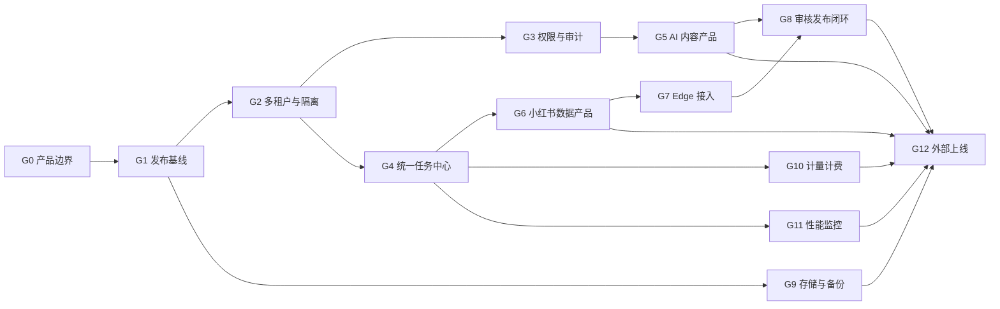

# 产品化总待办清单

更新日期：2026-08-06

> 本文是上一版研发技术附件，保留用于查阅历史分析，不再新增任务。当前大目标、任务编号、优先级和执行顺序统一以 [全系统思维导图与产品化任务拆分.md](./全系统思维导图与产品化任务拆分.md) 为准，避免两套 `G` 编号混用。

关联主文档：[2026-08-月度项目总结与产品化规划.md](./2026-08-月度项目总结与产品化规划.md)

## 1. 使用说明

这份清单用于项目排期、负责人分配、周会更新和月度验收。

状态定义：

| 状态 | 含义 |
|---|---|
| 已有 | 当前系统已经具备，可直接复用或只需小幅整理 |
| 部分 | 已经有基础，但不满足商业化交付要求 |
| 待建 | 当前基本没有，需要新增 |
| 阻塞 | 依赖业务决策、外部资源或前置任务 |

优先级定义：

| 优先级 | 含义 |
|---|---|
| P0 | 接入第二家客户或继续扩大使用前必须完成 |
| P1 | 第一版可售产品必须完成 |
| P2 | 规模化、企业化和效率提升能力 |

工作量定义：

| 工作量 | 参考范围 |
|---|---|
| S | 1-2 人日 |
| M | 3-5 人日 |
| L | 1-2 人周 |
| XL | 2 人周以上，需要单独拆任务 |

## 2. 大目标总览

| 编号 | 大目标 | 当前状态 | 目标结果 | 优先级 | 主要依赖 |
|---|---|---|---|---|---|
| G0 | 产品边界与交付模式 | 部分 | 明确卖什么、不卖什么、怎么交付 | P0 | 业务决策 |
| G1 | 发布基线与工程治理 | 部分 | 版本可追溯、可测试、可回滚 | P0 | 无 |
| G2 | 多租户与数据隔离 | 待建 | 第二家客户数据绝对隔离 | P0 | G0、G1 |
| G3 | RBAC、认证与审计 | 部分 | 权限可解释、操作可回溯 | P0 | G2 |
| G4 | 统一任务中心 | 部分 | 重任务不丢失、可重试、可审计 | P0 | G1、G2 |
| G5 | AI 内容产品化 | 部分 | AI 内容工作台可独立交付 | P1 | G2、G3、G9 |
| G6 | 小红书数据产品化 | 部分 | 数据连接、对账、看板可独立交付 | P1 | G2、G4 |
| G7 | Edge 登录与采集 | 部分 | 客户自带环境、账号和手机完成接入 | P1 | G4、G6 |
| G8 | 内容审核与云手机发布闭环 | 待建 | 内容生产、人工审核、云手机发布和数据回收形成闭环 | P1 | G4、G5、G7 |
| G9 | 存储、备份与数据导出 | 部分 | 数据不依赖单台 Windows，可恢复可导出 | P0 | G1 |
| G10 | 计量、成本与计费 | 待建 | 能算清每个租户成本和应收 | P1 | G2、G4 |
| G11 | 性能、监控与容量 | 部分 | 有指标、有告警、有容量结论 | P0 | G1、G4 |
| G12 | 外部上线与客户运营 | 待建 | 可灰度开通、收费、支持和退出 | P1 | G2-G11 |

## 3. 关键路径

可以并行的工作：

| 并行组 | 可并行内容 |
|---|---|
| A | G1 发布基线、G0 产品边界 |
| B | G2 多租户设计、G4 任务中心设计、G9 对象存储准备 |
| C | G5 AI 内容、G6 数据产品、G11 监控压测 |
| D | G7 Edge、G8 发布助手、G10 计费后台 |

不能颠倒的依赖：

| 前置 | 后续 | 原因 |
|---|---|---|
| 多租户上下文 | 用量计费 | 否则用量无法归属企业 |
| 统一任务 ID | 审计、成本、重试 | 否则三套记录无法串联 |
| 对象存储 | 外部图片交付 | 否则仍依赖 Windows 和 FRP |
| 数据 Scope | 第二家客户 | 否则存在跨企业数据风险 |
| Edge Agent | 第三方自动采集 | 否则客户必须连接公司 Windows |
| 容量测试 | SLA | 否则并发承诺没有依据 |
| HTTPS | 外部正式账号 | 否则登录和业务数据明文传输 |

## 4. G0 产品边界与交付模式

| ID | 子目标 | 具体待办 | 当前 | 交付物 | 验收标准 | 优先级 | 工作量 |
|---|---|---|---|---|---|---|---|
| G0-01 | 产品定位 | 确认主产品名称和一句话定位 | 部分 | 产品定位说明 | 所有人能用同一句话介绍产品 | P0 | S |
| G0-02 | 模块拆分 | 确认 AI 内容、数据洞察、Edge 采集、发布助手四个独立模块 | 部分 | 产品模块清单 | 每个模块有独立用户、输入、输出和价格单位 | P0 | S |
| G0-03 | 第一售卖范围 | 确认第一期只卖 AI 内容工作台 + 数据洞察 | 待决策 | V1 范围文档 | 明确包含项、排除项和交付边界 | P0 | S |
| G0-04 | 自动发布边界 | 确认全自动发布不作为默认承诺 | 待决策 | 风险与销售口径 | 销售、产品、研发口径一致 | P0 | S |
| G0-05 | 交付模式 | 定义纯 SaaS、客户自带 Edge、托管服务三种模式 | 部分 | 交付模式说明 | 每种模式写清账号、手机、环境和数据责任方 | P0 | M |
| G0-06 | 数据授权 | 定义客户可采集的数据范围和授权材料 | 待建 | 数据授权模板 | 每个采集任务可关联授权主体 | P0 | M |
| G0-07 | 产品指标 | 定义激活、使用、成功率、留存和续费指标 | 待建 | 产品指标字典 | 后续可以从系统统计核心漏斗 | P1 | M |

## 5. G1 发布基线与工程治理

| ID | 子目标 | 具体待办 | 当前 | 交付物 | 验收标准 | 优先级 | 工作量 |
|---|---|---|---|---|---|---|---|
| G1-01 | 版本基线 | 整理当前工作区未跟踪迁移和生产依赖代码 | 部分 | 可发布 Git 基线 | 生产代码全部可追溯到 commit | P0 | L |
| G1-02 | 仓库清理 | 将数据库、备份、CSV、图片结果、实验项目移出源码目录 | 待建 | 干净仓库规则 | 发布包不含运行数据和实验产物 | P0 | M |
| G1-03 | 密钥清理 | 删除部署脚本固定密码，改用 SSH Key/Secret | 待建 | 安全部署凭证 | 仓库搜索不到生产密码和 token | P0 | M |
| G1-04 | 依赖锁定 | 固定 Postgres、Redis、MinIO、Python、Node 镜像版本 | 部分 | 版本清单 | 相同版本可重复构建 | P0 | S |
| G1-05 | 自动测试 | 增加前端 type-check/build、后端测试、迁移检查 | 部分 | CI 流水线 | PR 未通过检查不能发布 | P0 | L |
| G1-06 | 数据库迁移 | 建立迁移演练、备份、执行、失败停止流程 | 部分 | Migration Runbook | 新环境和生产副本均能升级 | P0 | M |
| G1-07 | 发布产物 | 使用唯一版本号和不可覆盖镜像 tag | 待建 | 版本化镜像 | 线上版本可定位到镜像和 commit | P0 | M |
| G1-08 | 回滚流程 | 建立前端、后端和数据库回滚清单 | 部分 | Rollback Runbook | 30 分钟内恢复上一应用版本 | P0 | M |
| G1-09 | 环境分层 | 区分开发、测试、预发布、生产配置和数据库 | 待建 | 环境矩阵 | 测试不会连接生产数据库和存储 | P0 | L |

## 6. G2 多租户与数据隔离

| ID | 子目标 | 具体待办 | 当前 | 交付物 | 验收标准 | 优先级 | 工作量 |
|---|---|---|---|---|---|---|---|
| G2-01 | 租户模型 | 新增 tenants、workspaces、memberships | 待建 | 数据模型和迁移 | 可创建两个独立企业 | P0 | L |
| G2-02 | 默认租户 | 将现有全部数据回填到“当前公司”租户 | 待建 | 回填脚本与报告 | 回填前后业务总数一致 | P0 | L |
| G2-03 | 租户上下文 | 登录后由服务端解析 tenant，不接受任意租户参数 | 待建 | Tenant Context | 修改请求参数无法越权 | P0 | L |
| G2-04 | 核心表改造 | 用户数据、任务、素材、项目、XHS、报表增加 tenant_id | 待建 | 分批迁移 | 新数据全部带 tenant_id | P0 | XL |
| G2-05 | 共享级别 | 增加平台公共、企业共享、个人私有三级可见性 | 待建 | Visibility 规则 | 提示词、车型、模板按范围正确展示 | P1 | L |
| G2-06 | 唯一约束 | 将账号、幂等键、分类等唯一约束改为租户内唯一 | 待建 | 复合约束迁移 | 两租户可使用相同业务名称 | P0 | M |
| G2-07 | 文件隔离 | 文件对象记录 tenant_id，私有文件使用签名访问 | 待建 | 文件权限层 | 跨租户 URL 不可访问 | P0 | L |
| G2-08 | 越权测试 | 覆盖 API、图片、导出、任务、看板、后台 | 待建 | 安全测试矩阵 | 两个测试租户交叉访问全部 403/404 | P0 | L |
| G2-09 | 数据交接 | 成员离职时账号、素材、项目和任务可转交 | 待建 | 资产交接流程 | 停用用户不导致企业数据丢失 | P1 | M |

## 7. G3 RBAC、认证与审计

| ID | 子目标 | 具体待办 | 当前 | 交付物 | 验收标准 | 优先级 | 工作量 |
|---|---|---|---|---|---|---|---|
| G3-01 | 角色层次 | 拆分平台管理员和企业管理员 | 待建 | 角色矩阵 | 企业管理员不能访问其他企业 | P0 | M |
| G3-02 | 权限点 | 定义查看、创建、编辑、删除、执行、发布、导出、配置、审计 | 待建 | Permission Catalog | 所有核心接口映射权限点 | P0 | L |
| G3-03 | 数据 Scope | 统一全企业、部门、分配账号、本人四种数据范围 | 部分 | Scope Policy | 接口不再各自重复写角色判断 | P0 | L |
| G3-04 | 自定义角色 | 企业管理员按权限点创建角色 | 待建 | 角色管理页 | 不改代码即可新建企业角色 | P2 | L |
| G3-05 | 会话安全 | 增加短会话、刷新、设备会话和撤销 | 待建 | Session 模型 | 停用用户后旧会话立即失效 | P0 | L |
| G3-06 | 登录保护 | 增加失败限速、锁定、异常提醒和管理员 MFA | 待建 | 登录安全策略 | 暴力尝试会被限制并记录 | P0 | M |
| G3-07 | 全局审计 | 新增 audit_events，记录 before/after/result | 部分 | 审计服务 | 关键操作都能按时间线回放 | P0 | L |
| G3-08 | 审计覆盖 | 接入登录、角色、分配、密钥、导出、发布、删除、定时任务 | 待建 | 审计覆盖清单 | 抽查操作均有 actor 和 resource | P0 | L |
| G3-09 | 敏感数据 | token/API Key 加密存储，日志统一脱敏 | 待建 | Secret Service | 数据库无法直接读取完整第三方 Key | P0 | L |

## 8. G4 统一任务中心

| ID | 子目标 | 具体待办 | 当前 | 交付物 | 验收标准 | 优先级 | 工作量 |
|---|---|---|---|---|---|---|---|
| G4-01 | 任务模型 | 建立 jobs、job_attempts、job_events | 部分 | 统一任务表 | 所有任务有 tenant/user/type/status | P0 | L |
| G4-02 | 状态机 | 统一等待、领取、执行、成功、失败、取消、死信 | 部分 | 状态规范 | 不再出现无法解释的“后台未找到任务” | P0 | M |
| G4-03 | 租约心跳 | Worker 领取任务后续租，超时自动恢复 | 部分 | Lease 机制 | 杀掉 Worker 后任务能重新入队 | P0 | L |
| G4-04 | 幂等 | 业务幂等键和重复请求复用 | 部分 | Idempotency 规范 | 重复点击不会重复落库或发布 | P0 | M |
| G4-05 | 重试死信 | 按错误类型配置退避、重试和死信 | 部分 | Retry Policy | 永久错误不会无限重试 | P0 | M |
| G4-06 | 分片任务 | 批量账号任务拆父子任务并可并行 | 部分 | Batch Job | 100 个账号可看每项成功失败 | P0 | L |
| G4-07 | AI 迁移 | 将现有 AI Redis 队列接入统一事件和计量 | 部分 | AI Job Adapter | AI 任务可统一查询和审计 | P0 | M |
| G4-08 | XHS 迁移 | 迁移主页同步、互动、详情、报表刷新和聚合 | 部分 | XHS Workers | Web 重启不丢同步任务 | P0 | XL |
| G4-09 | 发布迁移 | 发布和定时发布退出 FastAPI 进程内任务 | 部分 | Publish Worker | 多 API 副本不会重复发布 | P0 | L |
| G4-10 | Dify 迁移 | Dify 长任务进入 Worker，SSE 只订阅事件 | 部分 | Workflow Worker | 断开页面不影响任务执行 | P1 | L |
| G4-11 | 用户控制 | 支持取消、重跑失败项、暂停、查看证据 | 部分 | 任务中心 UI | 用户能自己处理常见失败 | P1 | L |
| G4-12 | 调度器 | 定时器只创建任务，Leader 锁防止重复调度 | 部分 | Scheduler Service | 多副本只创建一次定时任务 | P0 | L |

## 9. G5 AI 内容产品化

| ID | 子目标 | 具体待办 | 当前 | 交付物 | 验收标准 | 优先级 | 工作量 |
|---|---|---|---|---|---|---|---|
| G5-01 | 企业资源 | 提示词、文案、素材、模板支持企业共享 | 部分 | 企业内容库 | 同租户可协作，跨租户不可见 | P1 | L |
| G5-02 | 提示词版本 | 增加版本、变量、适用车型、发布状态 | 待建 | Prompt Version | 可回滚并追踪生成使用版本 | P1 | L |
| G5-03 | 文案审批 | 草稿、审核、驳回、通过、发布包 | 部分 | Approval Flow | 每次修改和审核可追踪 | P1 | L |
| G5-04 | Provider 路由 | 健康、优先级、成本、质量和失败切换 | 部分 | Routing Policy | 单 Provider 故障时任务可降级 | P1 | L |
| G5-05 | 生成质量 | 保存模型、参数、参考图、结果尺寸和质量反馈 | 部分 | Generation Lineage | 任意图片可追溯生成来源 | P1 | M |
| G5-06 | 成本事件 | 每个 AI/Dify/OCR/去水印步骤写 usage_event | 待建 | 用量接入 | 管理员能按企业看到成本 | P1 | L |
| G5-07 | 版权字段 | 素材来源、授权范围、到期日和 AI 标识 | 待建 | Asset Rights | 未授权素材可被阻止发布 | P2 | L |
| G5-08 | 产品体验 | 企业开通后提供模板、示例和首个内容向导 | 待建 | Onboarding | 新用户无需培训完成首张图 | P1 | M |

## 10. G6 小红书数据产品化

| ID | 子目标 | 具体待办 | 当前 | 交付物 | 验收标准 | 优先级 | 工作量 |
|---|---|---|---|---|---|---|---|
| G6-01 | 账号主数据 | 账号、专业号、广告账号使用稳定 ID 关联 | 部分 | Account Master | 名称变化不影响归属和历史数据 | P0 | L |
| G6-02 | 数据分层 | 原始层、事实层、聚合层、快照层标准化 | 部分 | Data Architecture | 看板不直接扫描原始 JSON | P0 | XL |
| G6-03 | 运营聚合 | 为运营看板建立日级账号/负责人/帖子聚合 | 部分 | Insight Aggregates | 参数切换不会触发重型全表计算 | P0 | L |
| G6-04 | 投流聚合 | 完善现有账号/投手/品牌/笔记/标签聚合 | 部分 | Ad Aggregates V2 | 与原始报表自动对账一致 | P0 | L |
| G6-05 | 指标字典 | 记录名称、公式、来源、时间、空值和版本 | 待建 | Metric Catalog | 每个看板数字有明确口径 | P0 | M |
| G6-06 | 数据批次 | 记录请求参数、来源、范围、行数和校验和 | 部分 | Data Batch | 能定位某天数据来自哪个批次 | P0 | L |
| G6-07 | 质量检测 | 缺天、重复、突变、映射失败和汇总不等告警 | 待建 | DQ Rules | 错误数据在用户反馈前被发现 | P0 | L |
| G6-08 | 对账中心 | 原始、事实、聚合、看板四层自动对账 | 待建 | Reconciliation UI | 差异可下钻到账号和日期 | P1 | L |
| G6-09 | 看板快照 | 默认参数按租户预热，完成后原子替换 | 部分 | Snapshot Service | 用户不看到半成品数据 | P0 | M |
| G6-10 | 数据导入 | 不使用 Edge 的客户支持 Excel/API 导入 | 部分 | Import Connector | 客户能只买数据看板 | P1 | L |
| G6-11 | 数据导出 | 企业级异步导出和明细下钻 | 部分 | Export Jobs | 大导出不占用 Web 长连接 | P1 | L |

## 11. G7 Edge 登录与采集

| ID | 子目标 | 具体待办 | 当前 | 交付物 | 验收标准 | 优先级 | 工作量 |
|---|---|---|---|---|---|---|---|
| G7-01 | Windows Agent | 开机自启、心跳、版本、自动升级和日志 | 部分 | Edge Agent | Windows 重启后自动恢复在线 | P1 | XL |
| G7-02 | 租户绑定 | 每台 Agent、云登环境和设备绑定唯一租户 | 待建 | Edge Enrollment | Agent 不能领取其他租户任务 | P0 | L |
| G7-03 | 环境同步 | 客户同步自己的云登环境并确认授权 | 部分 | Environment Onboarding | 平台可展示环境健康和归属 | P1 | L |
| G7-04 | 登录检测 | 自动检测登录、失效、挑战和扫码需求 | 部分 | Login State | 采集前能判断是否可执行 | P1 | L |
| G7-05 | 验证码 | activation 与登录任务、手机号和设备关联 | 部分 | Login Activation | 验证码不会跨账号/租户匹配 | P1 | L |
| G7-06 | 二维码 | 客户自己的手机完成扫码并回传状态 | 部分 | QR Login | 失败有步骤、截图和错误 | P1 | L |
| G7-07 | 采集证据 | 每次采集保存页面摘要、截图、版本和 Runner | 部分 | Evidence Bundle | 能解释采集为空或失败原因 | P1 | L |
| G7-08 | 离线恢复 | Agent 离线任务等待，恢复后继续领取 | 待建 | Offline Recovery | 网络中断不丢任务 | P1 | M |
| G7-09 | 安全边界 | Agent 命令白名单，禁止开放任意 shell | 部分 | Command Policy | 服务端不能下发任意系统命令 | P0 | M |

## 12. G8 内容审核与云手机发布闭环

实施口径见 [内容生产审核与云手机发布闭环-明确版.md](./内容生产审核与云手机发布闭环-明确版.md)。本节只用于排期，不重复定义业务状态和接口。

| ID | 子目标 | 具体待办 | 当前 | 交付物 | 验收标准 | 优先级 | 工作量 |
|---|---|---|---|---|---|---|---|
| G8-01 | 内容任务 | 将需求、事实来源、参考文案、车型、目标账号和排期放入同一任务 | 待建 | Content Task | 一条内容从生产到复盘使用同一个任务 ID | P1 | L |
| G8-02 | 内容版本 | 每次生成或返工保存标题、正文、标签、图片和来源快照 | 待建 | Content Version | 审核和发布始终能定位到具体版本 | P1 | L |
| G8-03 | 机器预审 | 检查敏感词及变体、事实政策、图片 OCR、车型一致性、比例、缺图和版权 | 部分 | Preflight Report | 不合格内容不能提交人工审核 | P1 | L |
| G8-04 | 人工审核 | 支持通过、驳回、意见、指定返工项和再次提交 | 待建 | Approval Center | 每次决策都有审核人、时间、版本和原因 | P1 | L |
| G8-05 | 返工闭环 | 文案或图片按审核意见重新生成，旧版本只读保留 | 待建 | Rework Flow | 返工不会覆盖已审核记录，也不会误发旧版 | P1 | M |
| G8-06 | 审核锁定 | 审核通过后锁定内容版本，修改必须重新审核 | 待建 | Approval Gate | 未通过或审核后被修改的内容无法发布 | P0 | M |
| G8-07 | 排期与账号策略 | 账号级队列、频率、时间窗、冷却、每日上限和排期冲突检测 | 部分 | Publish Schedule | 同一账号不并发发布，排期冲突可见 | P0 | L |
| G8-08 | 云手机接口 | 与云手机侧定义创建任务、查询、取消、回调和鉴权协议 | 待建 | Cloud Phone API Contract | 测试环境可完整下发和回传一条任务 | P0 | L |
| G8-09 | 云手机执行 | 云手机领取任务，在小红书官方 App 填写标题正文、上传图片并发布 | 待建 | Mobile Publisher | 审核通过的指定版本能在指定账号发布 | P1 | XL |
| G8-10 | 状态回传 | 回传等待、领取、准备、发布中、成功、失败、需人工处理等事件 | 待建 | Publish Events | 平台展示真实进度，不依赖前端猜测状态 | P0 | M |
| G8-11 | 风控熔断 | 遇到验证码、二维码、警告、账号异常或 UI 变化立即暂停 | 部分 | Risk Circuit | 挑战页面不继续点击，任务转人工处理 | P0 | M |
| G8-12 | 发布证据 | 保存执行步骤、前后截图、帖子 ID、帖子链接、错误码和重试记录 | 部分 | Publish Evidence | 成功失败均可按任务完整回放 | P1 | M |
| G8-13 | 发布后回查 | 回查帖子是否真实存在，并触发主页、互动和效果数据同步 | 待建 | Post-publish Sync | 发布结果能进入运营看板和内容复盘 | P1 | L |

### 云手机接口最小约定

- 平台下发：发布任务 ID、幂等键、企业、目标账号、设备、审核版本、标题、正文、标签、图片地址、计划时间和回调地址。
- 云手机回传：任务状态、当前步骤、发生时间、截图、帖子 ID、帖子链接、错误码和错误说明。
- 双方必须支持：接口鉴权、签名校验、幂等、防重复发布、超时重试、状态查询、取消任务和跨企业隔离。
- 平台只允许发布“审核通过且内容未再修改”的版本；云手机不能接收任意脚本，只执行白名单发布动作。

## 13. G9 存储、备份与数据导出

| ID | 子目标 | 具体待办 | 当前 | 交付物 | 验收标准 | 优先级 | 工作量 |
|---|---|---|---|---|---|---|---|
| G9-01 | 对象存储 | 原图、AI 图、车型图、二维码和导出统一对象存储 | 部分 | Storage Migration | 清空 Windows 缓存后历史文件可用 | P0 | XL |
| G9-02 | 图片派生 | 自动生成缩略图、WebP 预览和尺寸元数据 | 部分 | Image Pipeline | 弱网先显示预览，不阻塞页面 | P1 | L |
| G9-03 | 文件权限 | 私有文件签名 URL，公开资源使用 CDN | 待建 | Access Policy | 猜测 URL 不能访问私有文件 | P0 | L |
| G9-04 | 上传优化 | 直传/分片上传，避免大文件经过 FRP | 待建 | Upload Service | 大文件上传可恢复且不占 Web 内存 | P1 | L |
| G9-05 | 自动备份 | Postgres 每日全量、增量/WAL、异地保存 | 部分 | Backup Jobs | 备份失败自动告警 | P0 | L |
| G9-06 | 保留策略 | 定义 7/30/180 天和临时文件生命周期 | 待建 | Retention Policy | 过期临时文件自动清理 | P1 | M |
| G9-07 | 恢复演练 | 每月恢复到新环境并记录 RPO/RTO | 待建 | Restore Report | 新环境能打开核心数据 | P0 | M |
| G9-08 | 企业导出 | 成员、账号、内容、素材、任务、报表、审计打包 | 待建 | Tenant Export | 客户退出时可完整导出 | P1 | L |

## 14. G10 计量、成本与计费

| ID | 子目标 | 具体待办 | 当前 | 交付物 | 验收标准 | 优先级 | 工作量 |
|---|---|---|---|---|---|---|---|
| G10-01 | 用量事件 | 新增 usage_events，关联 tenant/user/job/request | 待建 | Usage Ledger | 用量事件不可变且可去重 | P1 | L |
| G10-02 | AI 计量 | 记录输入/输出/缓存 token、图片数量和尺寸 | 部分 | AI Metering | 每笔 AI 任务可算供应商成本 | P1 | L |
| G10-03 | 工作流计量 | 记录 Dify 内部模型、OCR、搜索和步骤调用 | 待建 | Workflow Metering | 工作流成本不只算一次任务 | P1 | L |
| G10-04 | 自动化计量 | 记录采集账号数、发布次数、设备分钟和导出量 | 待建 | Automation Metering | 每个租户可看资源消耗 | P1 | M |
| G10-05 | 费率表 | Provider 成本价和客户销售价版本化 | 待建 | Rate Cards | 历史账单按当时费率重算一致 | P1 | M |
| G10-06 | 配额 | 用户、账号、设备、存储、并发和月用量限制 | 待建 | Quota Service | 超额时提醒、限速或阻止 | P1 | L |
| G10-07 | 套餐 | 团队、增长、企业版本和增值项 | 阻塞 | Plan Catalog | 销售口径和系统权限一致 | P1 | M |
| G10-08 | 账单 | 月度汇总、赠送、超额、调整和导出 | 待建 | Billing Statement | 任意账单可下钻到用量事件 | P1 | L |
| G10-09 | 毛利看板 | 租户收入、模型成本、存储和运维成本 | 待建 | Margin Dashboard | 能识别亏损客户和高成本模块 | P2 | M |

## 15. G11 性能、监控与容量

| ID | 子目标 | 具体待办 | 当前 | 交付物 | 验收标准 | 优先级 | 工作量 |
|---|---|---|---|---|---|---|---|
| G11-01 | 请求追踪 | request_id/trace_id/job_id 贯穿 API、Worker、Agent | 待建 | Trace Context | 一次任务日志可完整串联 | P0 | L |
| G11-02 | API 指标 | P50/P95/P99、错误率、吞吐和状态码 | 部分 | API Dashboard | 5 分钟内识别异常接口 | P0 | M |
| G11-03 | 数据库指标 | 连接池、慢 SQL、锁、IO、表大小和缓存命中 | 部分 | DB Dashboard | IO 100% 前提前告警 | P0 | M |
| G11-04 | 队列指标 | 深度、等待时间、执行时间、重试和死信 | 部分 | Queue Dashboard | 能解释任务为什么排队 | P0 | M |
| G11-05 | Edge 指标 | Agent/云登/手机在线、版本和任务成功率 | 部分 | Edge Dashboard | 离线和版本落后自动告警 | P1 | L |
| G11-06 | 容器限制 | CPU、内存、日志轮转和磁盘阈值 | 待建 | Resource Limits | 单任务不能拖垮整台机器 | P0 | M |
| G11-07 | 压测基线 | HTTP、看板、AI 队列、SSE、导出、Edge 分项压测 | 待建 | Load Test Report | 得出首期容量和瓶颈 | P0 | L |
| G11-08 | 错误聚合 | 相同错误去重并保留版本、用户和任务上下文 | 待建 | Error Tracking | 线上错误无需逐个翻容器日志 | P0 | M |
| G11-09 | SLA | 根据压测和恢复演练确定可承诺指标 | 阻塞 | SLA 文档 | 销售承诺有测试依据 | P1 | S |

## 16. G12 外部上线与客户运营

| ID | 子目标 | 具体待办 | 当前 | 交付物 | 验收标准 | 优先级 | 工作量 |
|---|---|---|---|---|---|---|---|
| G12-01 | 开通向导 | 企业、成员、品牌、账号、数据源、首个任务 | 待建 | Onboarding Wizard | 新客户可独立完成基础配置 | P1 | L |
| G12-02 | 域名 HTTPS | 正式域名、证书、同源 API 和续期告警 | 待建 | HTTPS 入口 | 浏览器无证书和混合内容警告 | P0 | M |
| G12-03 | 入口保护 | 登录限速、WAF/边缘限流、安全响应头 | 部分 | Edge Policy | 常见扫描和暴力登录被拦截 | P0 | M |
| G12-04 | 支付/合同 | 先支持线下合同账单，后接在线支付 | 待建 | 收款流程 | 套餐状态和服务状态一致 | P1 | L |
| G12-05 | 客服工单 | 客户问题关联租户、任务、账号和日志 | 待建 | Support Console | 客服无需直接查数据库 | P1 | L |
| G12-06 | 状态页 | 展示平台、AI、数据源和 Edge 服务状态 | 待建 | Status Page | 事故时客户能看到进度 | P2 | M |
| G12-07 | 灰度发布 | 内部、试点租户、全量三级发布 | 待建 | Rollout Policy | 可按租户回退功能 | P1 | M |
| G12-08 | 数据退出 | 租户导出、停用、保留期和删除 | 待建 | Offboarding | 客户退出流程可执行可审计 | P0 | M |
| G12-09 | 合规材料 | 用户协议、隐私、数据授权、AI 内容和自动化风险说明 | 待建 | 合规文档包 | 客户开通前完成确认 | P0 | L |
| G12-10 | 试点客户 | 选择 1-3 家客户执行完整灰度 | 阻塞 | Pilot Report | 连续运行 30 天达到成功率目标 | P1 | XL |

## 17. 里程碑计划

| 里程碑 | 范围 | 完成标志 | 建议周期 |
|---|---|---|---|
| M0 产品确认 | G0 | 确定第一期产品和交付模式 | 第 1 周 |
| M1 内部底座 | G1、G4、G9、G11 基础项 | 可回滚、任务不丢、可备份、有监控 | 第 2-5 周 |
| M2 第二租户 | G2、G3 | 两个租户数据和文件完全隔离 | 第 4-8 周 |
| M3 可售模块 | G5、G6、G10 | AI 内容和数据洞察可开通、可计量 | 第 7-11 周 |
| M4 客户 Edge | G7、G8 | 客户用自己环境完成采集，并跑通内容审核与云手机发布闭环 | 第 10-14 周 |
| M5 外部灰度 | G12 | 1-3 家客户连续灰度 30 天 | 第 15 周以后 |

## 18. 第一批执行清单

第一批建议启动以下 18 项：

| 顺序 | 任务 ID | 任务 | 完成定义 |
|---:|---|---|---|
| 1 | G0-03 | 确认第一售卖范围 | 形成包含/排除清单 |
| 2 | G0-04 | 确认自动发布边界 | 不作为默认商业承诺 |
| 3 | G1-01 | 整理生产代码基线 | 生产版本可追溯 |
| 4 | G1-03 | 清除固定凭证 | 部署改 SSH Key/Secret |
| 5 | G1-06 | 迁移与回滚演练 | 生产副本升级成功 |
| 6 | G2-01 | 设计租户模型 | 评审通过数据模型 |
| 7 | G2-02 | 设计现有数据回填 | 有校验和回滚方案 |
| 8 | G3-02 | 制定权限点清单 | 核心接口全部映射 |
| 9 | G4-01 | 统一任务数据模型 | AI/XHS/Dify 可共用 |
| 10 | G4-08 | 选定第一批 XHS 迁移 | 先迁主页同步和报表刷新 |
| 11 | G6-05 | 建立指标字典 | 两个看板指标先完成 |
| 12 | G6-07 | 建立数据质量规则 | 缺天、重复、映射失败先上线 |
| 13 | G9-05 | 自动数据库备份 | 每日执行并异地保存 |
| 14 | G10-01 | 设计用量事件 | 能关联租户、任务、模型和成本 |
| 15 | G11-03 | 数据库和磁盘监控 | IO、慢 SQL、空间阈值可告警 |
| 16 | G8-01 | 设计内容任务与版本 | 需求、来源、文案、图片、账号和版本可追溯 |
| 17 | G8-04 | 设计人工审核与返工 | 支持通过、驳回、意见、返工和重新提交 |
| 18 | G8-08 | 确定云手机发布接口 | 下发、查询、取消、回调、鉴权和幂等协议评审通过 |

## 19. 周会更新模板

每周只更新以下字段，不需要重复写长篇总结：

| 任务 ID | 负责人 | 本周状态 | 完成度 | 本周产出 | 阻塞项 | 下周动作 | 预计完成 |
|---|---|---|---:|---|---|---|---|
| 示例：G4-01 | 待分配 | 进行中 | 30% | 完成任务状态机草案 | 租户字段未定 | 联合评审数据模型 | 2026-08-14 |

## 20. 月度验收问题

每月底统一回答以下问题：

| 验收问题 | 是/否 | 证据 |
|---|---|---|
| 第二家客户能否创建且数据绝对隔离 |  |  |
| 任意重任务重启后能否恢复 |  |  |
| 任意关键操作能否找到操作人和变更前后值 |  |  |
| 任意 AI 调用能否计算供应商成本 |  |  |
| 看板任意数字能否下钻和对账 |  |  |
| 客户能否使用自己的云登环境和手机接入 |  |  |
| 发布任务遇到挑战时是否自动暂停 |  |  |
| 数据库和文件能否从异地备份恢复 |  |  |
| 当前并发和 SLA 是否有压测依据 |  |  |
| 第一版产品是否可以独立开通、计量和退出 |  |  |
