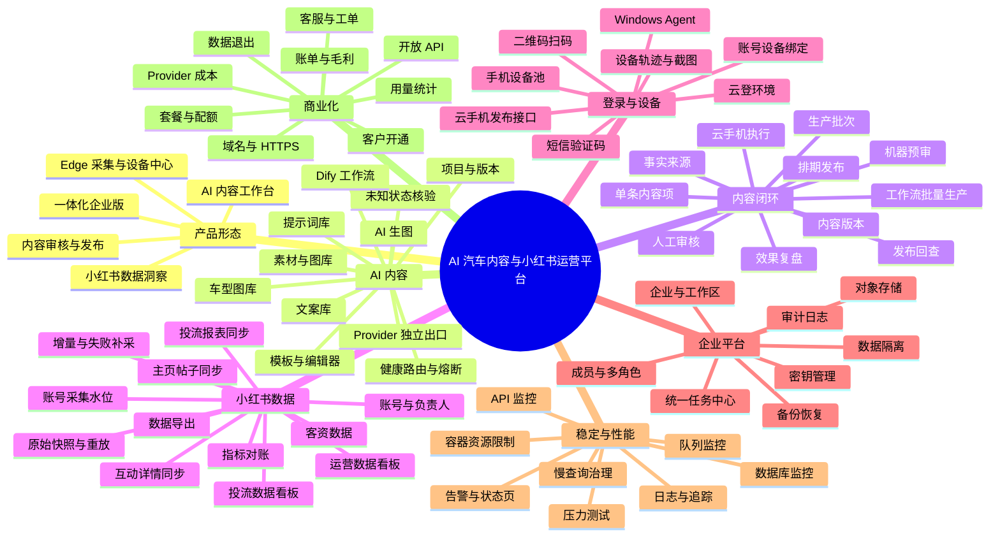
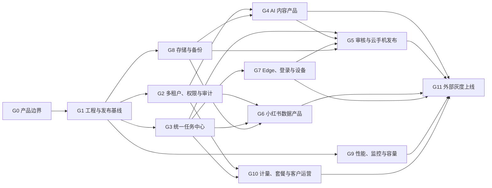

# 全系统思维导图与产品化任务拆分

更新日期：2026-08-07

## 一、这份文档解决什么问题

这份文档把当前系统从“很多能用的内部功能”，拆成一套可以排期、验收和最终对外销售的产品任务。

每个任务只回答四件事：

1. 当前有什么。
2. 现在的问题是什么。
3. 需要优化或新增什么。
4. 做到什么程度才算完成。

优先级：

- `P0`：继续扩大内部使用或接入第二家客户前必须完成。
- `P1`：形成第一版可售产品必须完成。
- `P2`：规模化、私有化和商业运营能力。

## 二、整个系统思维导图

## 三、当前系统与目标系统的区别

| 维度 | 当前系统 | 目标系统 |
|---|---|---|
| 使用对象 | 公司内部一个组织 | 多家企业可独立开通 |
| 功能关系 | 生图、工作流、发布、看板分别能用 | 内容、审核、发布、数据形成闭环 |
| 数据边界 | 主要按用户、部门和账号过滤 | 企业、工作区、角色和账号四层隔离 |
| 重任务 | AI 有队列，部分同步和发布仍依赖 Web 进程 | 全部进入持久化统一任务中心 |
| 文件 | 部分依赖 Windows 本地目录 | 对象存储、签名访问、缩略图和生命周期 |
| 自动化 | 公司统一维护云登、手机和 Windows | 客户自带环境和设备，平台只做总控 |
| 数据看板 | 能展示，但仍需人工查缺天和映射问题 | 指标有口径、批次、对账和质量告警 |
| 运维 | 出现卡死或磁盘满后人工查日志 | 监控、告警、限流、备份和恢复演练 |
| 成本 | 能看到部分调用次数 | 能按企业、用户、任务和模型算真实成本 |
| 上线方式 | 公网 IP、HTTP、FRP 到 Windows | 最后收口域名、HTTPS、安全入口和灰度发布 |

## 四、哪些是优化现有功能，哪些是新增功能

### 需要重点优化的现有功能

| 模块 | 主要优化内容 |
|---|---|
| AI 生图 | Provider 路由、任务稳定性、弱网图片、成本记录、失败恢复 |
| 提示词和文案 | 企业私有、版本、来源、审核、引用效果 |
| 素材和车型库 | 对象存储、版本、去重、版权、批量导入质量 |
| 工作流 | 长任务队列、凭证安全、运行成本、结果进入内容任务 |
| 发布管理 | 从直接发布改为受审核版本发布，并保留旧手工入口 |
| 主页同步 | 批量并发、历史记录、失败重跑、执行证据、登录检查 |
| 两个看板 | 指标口径、聚合快照、数据对账、查询速度、异常提示 |
| 账号分配 | 使用稳定 ID，名称变化和环境删除不能破坏历史归属 |
| 管理后台 | 企业、权限、配额、审计、密钥和客户开通 |
| 部署运维 | 环境隔离、版本回滚、监控、备份、磁盘治理 |

### 必须新增的功能

| 新功能 | 目的 |
|---|---|
| 企业与工作区 | 支持第二家公司并保证数据隔离 |
| 统一任务中心 | 所有重任务重启不丢、可重试、可追踪 |
| 工作流内容生产批次与版本 | 把工作流输出、素材、审核和发布串起来，不覆盖独立 AI 生图 |
| 机器预审与人工审核 | 防止错误事实、敏感词和旧版本误发 |
| 云手机发布接口 | 审核通过后在官方 App 执行发布 |
| 数据质量与对账中心 | 自动发现缺天、重复、映射和汇总差异 |
| 客户 Edge 接入 | 客户使用自己的云登、电脑、账号和手机 |
| 用量与成本台账 | 计算每家客户的真实成本和毛利 |
| 套餐、配额和账单 | 支持正式收费和限制资源使用 |
| 客户全生命周期 | 覆盖试用、开通、资产接入、验收、运营变更、冻结、导出、保留期、删除和删除证明 |

## 五、大目标与依赖关系

## 六、任务点详细拆分

## G0 产品边界与交付模式

目标：先确定卖什么、谁负责什么，避免继续把内部工具无限堆成一个系统。

| ID | 类型 | 任务 | 完成标准 | 优先级 |
|---|---|---|---|---|
| G0-01 | 决策 | 确定第一版产品范围 | 有明确包含项和排除项 | P0 |
| G0-02 | 决策 | 将系统拆成 AI 内容、数据洞察、发布闭环、Edge 设备四个模块 | 每个模块有用户、输入、输出和收费单位 | P0 |
| G0-03 | 决策 | 定义纯 SaaS、客户自带 Edge、托管运营三种交付方式 | 账号、手机、环境和数据责任方写清楚 | P0 |
| G0-04 | 决策 | 明确自动发布开放边界 | 未经人工审核不发布，全自动只对授权客户开放 | P0 |
| G0-05 | 新增 | 建立产品功能开关 | 可按企业启用或关闭采集、发布、AI 和设备功能 | P1 |
| G0-06 | 新增 | 定义产品核心指标 | 能统计激活、任务成功率、使用率、成本和续费风险 | P1 |

## G1 工程、环境与发布基线

目标：任何版本都能追溯、测试、部署和回滚，不再依赖某台电脑里的临时文件。

| ID | 类型 | 任务 | 完成标准 | 优先级 |
|---|---|---|---|---|
| G1-01 | 优化 | 清理仓库中的数据库、备份、图片和实验产物 | 发布包只包含代码和必要配置模板 | P0 |
| G1-02 | 优化 | 整理当前生产依赖但未正式版本化的代码和迁移 | 线上运行内容全部对应 Git commit | P0 |
| G1-03 | 新增 | 分离开发、测试、预发布和生产环境 | 本地测试绝不连接生产数据库和存储 | P0 |
| G1-04 | 优化 | 固定 Python、Node、Postgres、Redis 和 MinIO 版本 | 相同版本可重复构建 | P0 |
| G1-05 | 新增 | 建立自动检查 | 前端构建、类型检查、后端测试、迁移检查自动执行 | P0 |
| G1-06 | 优化 | 建立版本化镜像和发布记录 | 每次发布可查版本、变更、操作人和时间 | P0 |
| G1-07 | 新增 | 建立应用和数据库回滚流程 | 30 分钟内可恢复上一可用版本 | P0 |
| G1-08 | 优化 | 清除仓库和脚本中的固定密码与 Key | 使用 Secret、环境变量和 SSH Key | P0 |

## G2 多租户、权限、安全与审计

目标：不同企业互相看不到数据，企业管理员也不能越权访问其他企业。

| ID | 类型 | 任务 | 完成标准 | 优先级 |
|---|---|---|---|---|
| G2-01 | 新增 | 增加企业、工作区和企业成员 | 可创建两家独立测试企业 | P0 |
| G2-02 | 新增 | 为核心业务表和文件增加企业归属 | 新增数据全部带 `tenant_id` | P0 |
| G2-03 | 新增 | 将现有数据回填到“当前公司”企业 | 回填前后数量和业务汇总一致 | P0 |
| G2-04 | 优化 | 平台管理员与企业管理员分离 | 企业管理员无法查看其他企业 | P0 |
| G2-05 | 优化 | 将角色判断改为权限点 | 查看、编辑、审核、发布、导出、配置分别授权 | P0 |
| G2-06 | 优化 | 统一全企业、部门、分配账号、本人四种数据范围 | 所有接口使用同一套 Scope 规则 | P0 |
| G2-07 | 新增 | 建立全局审计日志 | 登录、分配、审核、发布、导出和删除均可回放 | P0 |
| G2-08 | 优化 | 第三方 Key 加密存储并统一脱敏 | 数据库和页面不展示完整 Key | P0 |
| G2-09 | 新增 | 增加跨企业越权自动测试 | API、图片、任务、导出、看板全部验证 | P0 |

## G3 统一任务中心

目标：AI、工作流、同步、报表、发布和导出全部可排队、恢复、重试和追踪。

| ID | 类型 | 任务 | 完成标准 | 优先级 |
|---|---|---|---|---|
| G3-01 | 新增 | 建立统一任务、执行尝试和事件模型 | 所有重任务有统一任务 ID | P0 |
| G3-02 | 优化 | 统一任务状态和错误码 | 不再出现无法解释的“后台未找到任务” | P0 |
| G3-03 | 优化 | 重任务退出 Web 请求进程 | 浏览器断开或 API 重启不影响执行 | P0 |
| G3-04 | 新增 | 增加租约、心跳和超时回收 | Worker 崩溃后任务能恢复领取 | P0 |
| G3-05 | 新增 | 增加幂等和防重复执行 | 重复点击不会重复生成、落库或发布 | P0 |
| G3-06 | 优化 | 批量任务拆成父任务和子任务 | 每个账号或内容项能看到独立成功失败 | P0 |
| G3-07 | 新增 | 增加重试、退避和死信 | 永久错误不无限重试，可单独重跑失败项 | P0 |
| G3-08 | 优化 | 定时任务只创建任务，由唯一调度器负责 | 多实例不会重复触发任务 | P0 |
| G3-09 | 优化 | 统一任务中心页面 | 支持筛选、取消、重跑、证据和事件时间线 | P1 |
| G3-10 | 新增 | 用户任务通知 | 失败、需人工、完成时站内提醒，后续可接企微 | P1 |

## G4 AI 内容产品化

目标：把生图、提示词、文案、工作流、车型和编辑器变成一个可独立销售的内容工作台。

| ID | 类型 | 任务 | 完成标准 | 优先级 |
|---|---|---|---|---|
| G4-01 | 优化 | 提示词增加版本、变量、车型和适用场景 | 可回滚并统计哪个版本效果好 | P1 |
| G4-02 | 新增 | 企业私有提示词、文案和知识来源 | 平台公共、企业共享、个人私有正确隔离 | P1 |
| G4-03 | 优化 | Provider 增加健康、优先级、成本和失败切换 | 单一供应商异常时可降级 | P1 |
| G4-04 | 优化 | 保存完整生成血缘 | 图片可追溯模型、提示词、参数、参考图和用户 | P1 |
| G4-05 | 优化 | AI 任务接入统一任务中心 | 排队、取消、恢复和失败记录统一 | P0 |
| G4-06 | 优化 | 素材、车型图和 AI 图统一对象存储 | Windows 本地文件删除后仍可访问 | P0 |
| G4-07 | 优化 | 车型库增加稳定 ID、版本、去重和版权字段 | 重复导入不翻倍，替换可追溯 | P1 |
| G4-08 | 优化 | 编辑器项目增加历史版本和恢复 | 误保存后可以恢复上一版本 | P1 |
| G4-09 | 优化 | 定义工作流标准输出协议 | 工作流统一输出标题、正文、标签、图片和来源信息 | P1 |
| G4-10 | 新增 | 每个模型步骤记录用量和成本 | 任意任务可计算真实供应商成本 | P1 |
| G4-11 | 优化 | Provider 使用独立出口路由 | 生产调用不依赖服务器系统全局 VPN | P0 |
| G4-12 | 新增 | 建立网络到结果下载的分段监控 | DNS、连接、TLS、受理、生成和下载错误可区分 | P0 |
| G4-13 | 优化 | 分离连接、受理、生成和下载超时 | 不再用一个超时覆盖整条链路 | P0 |
| G4-14 | 优化 | 保存幂等键、上游任务 ID 和待核验状态 | 本地失联后先查询原任务，不盲目重提 | P0 |
| G4-15 | 新增 | Provider 与出口健康评分、熔断和半开恢复 | 故障路由停止接收新任务并渐进恢复 | P0 |
| G4-16 | 优化 | 等价 Provider 安全切换 | 兼容模型可降级，不兼容或变价时不静默切换 | P1 |
| G4-17 | 优化 | 生成、下载、去水印和平台存储解耦 | 下载或后处理失败不重新调用付费生图 | P0 |
| G4-18 | 新增 | 完整脱敏上游日志和费用核验 | 524 等错误可定位原始响应和是否计费 | P0 |
| G4-19 | 新增 | 生图故障演练和 SLO | VPN 抖动、上游异常和 Worker 重启时任务最终收敛 | P0 |

## G5 内容生产、审核与云手机发布

目标：形成“生产批次 → 内容版本 → 机器预审 → 人工审核 → 云手机发布 → 数据复盘”闭环。

完整口径见 [内容生产审核与云手机发布闭环-明确版.md](./内容生产审核与云手机发布闭环-明确版.md)。

| ID | 类型 | 任务 | 完成标准 | 优先级 |
|---|---|---|---|---|
| G5-01 | 新增 | 建立基于已发布工作流版本的生产批次和单条内容项 | 一批 57 条由指定工作流生产，并可分别审核和发布 | P1 |
| G5-02 | 新增 | 将工作流标准输出转换为不可修改的内容版本和来源快照 | 修改后生成新版本，旧审核不复用 | P0 |
| G5-03 | 新增 | 建立机器预审 | 检查事实、敏感词、OCR、车型、比例和素材完整性 | P1 |
| G5-04 | 新增 | 建立人工审核中心 | 支持通过、退回、作废、意见和版本差异 | P1 |
| G5-05 | 新增 | 建立审核门禁 | 未审核、审核失效或政策过期的内容不能发布 | P0 |
| G5-06 | 新增 | 建立发布单、发布尝试和发布事件 | 业务排期与每次设备执行分开保存 | P0 |
| G5-07 | 新增 | 定义云手机账号绑定和发布 API | 支持创建、查询、取消、回调、签名和幂等 | P0 |
| G5-08 | 新增 | 云手机实现小红书官方 App 图文发布 | 使用测试账号真实跑通一条内容 | P1 |
| G5-09 | 新增 | 建立待核验和人工接管 | 状态不确定时不盲目重发 | P0 |
| G5-10 | 优化 | 发布成功后回查并关联帖子事实 | 找到真实帖子 ID、链接和发布时间才算成功 | P0 |
| G5-11 | 新增 | 内容效果复盘 | 可按来源、车型、模板和账号查看发布效果 | P1 |

## G6 小红书数据产品化

目标：数据来源清楚、计算一致、切换参数快，任何数字都能下钻和对账。

当前必须按两个里程碑分别判断，不能因为页面已经搭好就认为数据产品已经完成：

| 看板 | 当前真实状态 | 当前可否作为准确数据交付 | 达到正式可用还缺什么 |
|---|---|---|---|
| 小红书投流数据面板 | 广告报表、映射、聚合和看板已跑通，当前是唯一已有准确数据并可继续对账的看板 | 可以，仍需保留数据截止时间、缺失告警和源报表对账 | 多租户数据源授权、批次监控、异常告警和产品化 SLA |
| 小红书运营数据看板 | 页面、指标和部分聚合已完成，但账号主页、帖子、互动和客资数据覆盖仍依赖云手机采集链路 | 不可以作为完整准确数据对外交付 | 云手机采集完整上线、全账号稳定登录、每日增量、失败补采、互动与客资对账、连续周期完整性验收 |

运营看板在完成上述验收前必须显示“数据建设中”和实际数据截止范围，不能只因页面可访问就对外宣称数据准确。

| ID | 类型 | 任务 | 完成标准 | 优先级 |
|---|---|---|---|---|
| G6-01 | 优化 | 账号、专业号、广告账号使用稳定 ID | 改名或删除云登环境不破坏历史数据 | P0 |
| G6-02 | 优化 | 明确原始层、事实层、聚合层和快照层 | 看板不直接扫描大量原始 JSON | P0 |
| G6-03 | 优化 | 完善运营与投流日级聚合 | 常用日期和人员切换不触发重型全表计算 | P0 |
| G6-04 | 新增 | 建立指标字典 | 每个指标有中文名、来源、公式、空值和版本 | P0 |
| G6-05 | 新增 | 建立数据批次记录 | 可查某天某账号数据来自哪次同步 | P0 |
| G6-06 | 新增 | 建立数据质量规则 | 缺天、重复、突变和映射失败自动告警 | P0 |
| G6-07 | 新增 | 建立四层自动对账 | 原始、事实、聚合、看板差异可下钻 | P1 |
| G6-08 | 优化 | 默认看板快照预热并原子替换 | 用户不看到半成品或长时间卡死 | P0 |
| G6-09 | 优化 | 重查询增加索引、缓存和执行计划治理 | 默认看板达到约定响应时间 | P0 |
| G6-10 | 优化 | 大表格导出异步化 | 导出不占 Web 长连接，可查看任务进度 | P1 |
| G6-11 | 新增 | 数据源健康中心 | 能看报表 Token、客资接口、云登和最近成功时间 | P1 |
| G6-12 | 新增 | 看板数据更新时间与缺失提示 | 用户知道数据截止到哪天、缺什么 | P1 |
| G6-13 | 优化 | 固化投流看板准确数据基线 | 选定日期、广告账户、投手和专业号与源报表逐项一致 | P0 |
| G6-14 | 新增 | 云手机运营数据采集执行器 | 可按企业和账号稳定采集主页帖子、帖子详情和互动数据 | P0 |
| G6-15 | 新增 | 运营账号全覆盖与登录健康清单 | 每个应采账号都有设备、登录状态、最近采集和失败原因 | P0 |
| G6-16 | 新增 | 运营数据每日增量和失败补采 | 每天自动采集，漏项自动重试并可人工重跑失败账号 | P0 |
| G6-17 | 新增 | 运营看板完整性验收 | 连续约定周期内账号、帖子、互动和客资与来源逐日对账通过 | P0 |
| G6-18 | 新增 | 看板产品状态门禁 | 未验收运营看板标记建设中，投流与运营成熟度分别展示 | P1 |
| G6-19 | 优化 | 为每个账号建立采集水位和阶段状态 | 能看到全量、增量、列表、详情和互动分别完成到哪里 | P0 |
| G6-20 | 优化 | 采集父任务拆成账号和帖子子任务 | 已成功项保留，可只重跑失败账号或失败帖子 | P0 |
| G6-21 | 新增 | 保存原始抓取快照并支持解析重放 | 解析规则修复后不需要重新操作页面 | P0 |
| G6-22 | 优化 | 建立全量、增量重叠、定期校准和历史补采 | 置顶、删帖和排序变化不会导致静默漏数 | P0 |
| G6-23 | 优化 | 使用稳定 ID 幂等落库和批次血缘 | 重复执行不重复，任意数据可反查采集批次 | P0 |
| G6-24 | 新增 | 建立采集错误分类和断点恢复 | 登录、页面、网络、解析和落库分别处置 | P0 |
| G6-25 | 优化 | 多 Agent、设备和账号冲突调度 | 不同账号并行，同一账号水位不被并发覆盖 | P0 |
| G6-26 | 新增 | 建立账号覆盖率、完整率和准时率 | 运营看板是否可上线有量化依据 | P0 |

账号采集与生图的完整治理方案见 [账号数据采集与AI生图稳定性专项.md](./账号数据采集与AI生图稳定性专项.md)。

## G7 Edge、登录与设备平台

目标：第三方客户使用自己的云登、Windows、账号、手机号和手机，平台不共享客户登录资产。

| ID | 类型 | 任务 | 完成标准 | 优先级 |
|---|---|---|---|---|
| G7-01 | 优化 | Windows Agent 服务化 | 开机自启、断线重连、自动升级和本地日志 | P1 |
| G7-02 | 新增 | Agent 注册和企业绑定 | Agent 只能领取本企业任务 | P0 |
| G7-03 | 优化 | 客户云登环境同步和授权确认 | 平台显示环境归属、账号和健康状态 | P1 |
| G7-04 | 新增 | 登录状态中心 | 采集或发布前识别登录、失效、挑战和扫码需求 | P1 |
| G7-05 | 优化 | 验证码 activation 与登录任务关联 | 验证码不跨账号、手机号或企业匹配 | P1 |
| G7-06 | 优化 | 二维码任务轨迹和截图 | 失败时能定位到具体手机步骤 | P1 |
| G7-07 | 新增 | 小红书账号与设备/App 槽位绑定 | 换手机只改绑定，不改业务任务 | P1 |
| G7-08 | 优化 | 设备离线任务等待和恢复 | 网络恢复后继续，任务不丢 | P1 |
| G7-09 | 优化 | 设备命令白名单 | 不允许平台下发任意 shell 或坐标脚本 | P0 |
| G7-10 | 新增 | 设备健康和版本告警 | 离线、低电量、权限失效和版本过旧自动提醒 | P1 |

## G8 存储、备份与数据导出

目标：数据不依赖单台 Windows，数据库或磁盘故障后可以恢复。

| ID | 类型 | 任务 | 完成标准 | 优先级 |
|---|---|---|---|---|
| G8-01 | 优化 | 所有图片、车型、二维码和导出统一对象存储 | 本地缓存清空后历史文件仍可用 | P0 |
| G8-02 | 新增 | 自动生成缩略图、WebP 和尺寸元数据 | 弱网先加载小图，预览不阻塞页面 | P1 |
| G8-03 | 新增 | 私有文件签名访问 | 猜测 URL 无法访问其他企业文件 | P0 |
| G8-04 | 优化 | 大文件直传或分片上传 | 上传可恢复，不经过 Web 进程占满内存 | P1 |
| G8-05 | 新增 | 文件生命周期和清理任务 | 临时文件按规则清理，正式资产不误删 | P1 |
| G8-06 | 优化 | Postgres 每日备份和异地保存 | 备份失败自动告警 | P0 |
| G8-07 | 新增 | 定期恢复演练 | 能在新环境恢复数据库和核心文件 | P0 |
| G8-08 | 新增 | 企业完整数据导出 | 成员、内容、素材、任务、报表和审计可打包 | P1 |

## G9 性能、监控与容量

目标：系统卡死前就能发现问题，并明确可以支持多少用户和并发任务。

| ID | 类型 | 任务 | 完成标准 | 优先级 |
|---|---|---|---|---|
| G9-01 | 新增 | 请求 ID、任务 ID 和追踪 ID 贯穿日志 | 一次操作可串起 API、Worker、Agent 和云手机 | P0 |
| G9-02 | 新增 | API 延迟、错误率和吞吐监控 | 可查看 P50、P95、P99 和错误接口 | P0 |
| G9-03 | 优化 | 数据库慢 SQL、锁、连接池和 IO 监控 | 磁盘 IO 100% 前收到告警 | P0 |
| G9-04 | 新增 | 队列深度、等待时间、重试和死信监控 | 能解释任务为什么排队 | P0 |
| G9-05 | 优化 | 容器 CPU、内存、日志和磁盘限制 | 单个任务不能拖垮整台机器 | P0 |
| G9-06 | 优化 | 日志轮转和错误聚合 | 相同错误合并，并保留版本和任务上下文 | P0 |
| G9-07 | 新增 | 看板、AI、同步、发布、导出分项压测 | 得出第一版容量和瓶颈报告 | P0 |
| G9-08 | 新增 | 告警中心和状态页 | 数据库、AI、Edge、云手机异常主动通知 | P1 |
| G9-09 | 新增 | 服务健康检查和自动恢复 | 关键进程异常可安全重启，不造成重复任务 | P0 |

## G10 计量、套餐与客户运营

目标：能算清每家企业用了多少、成本多少、应该收多少钱。

| ID | 类型 | 任务 | 完成标准 | 优先级 |
|---|---|---|---|---|
| G10-01 | 新增 | 建立不可变用量台账 | 每次 AI、工作流、采集、发布和存储都有记录 | P1 |
| G10-02 | 新增 | Provider 成本费率版本化 | 历史任务按当时价格重算一致 | P1 |
| G10-03 | 新增 | 企业、用户和模块成本看板 | 能找到高成本任务和亏损客户 | P1 |
| G10-04 | 新增 | 套餐和配额 | 限制成员、账号、设备、存储、并发和月用量 | P1 |
| G10-05 | 新增 | 超额处理 | 支持提醒、限速、阻止或人工放行 | P1 |
| G10-06 | 新增 | 企业开通向导 | 可完成企业、成员、品牌、账号和首个任务配置 | P1 |
| G10-07 | 新增 | 月度账单和导出 | 用量、赠送、超额和调整可下钻 | P1 |
| G10-08 | 新增 | 客服工单 | 问题能关联企业、用户、任务、账号和日志 | P2 |
| G10-09 | 新增 | 开放 API、Webhook 和 API Key | 外部系统可安全创建任务和接收结果 | P2 |
| G10-10 | 新增 | 客户退出主流程 | 支持身份确认、停止新任务、资产清点、导出、保留期和删除 | P1 |
| G10-11 | 新增 | 试用、合同和交付范围登记 | 明确模块、模式、配额、责任边界和数据授权 | P1 |
| G10-12 | 新增 | 客户资产接入与验收 | 账号、广告账户、Agent、云手机、密钥和历史数据逐项验收 | P1 |
| G10-13 | 新增 | 客户运营变更流程 | 成员、负责人、资产、套餐和密钥变更可审批和回溯 | P1 |
| G10-14 | 新增 | 暂停、只读和风险冻结 | 停止新任务但不破坏运行中写入，支持安全恢复 | P1 |
| G10-15 | 新增 | 企业退出数据包 | 数据范围、数量、格式、校验值和下载记录可核验 | P1 |
| G10-16 | 新增 | 保留期、法律保留和恢复 | 不同保留原因独立管理，到期前可按规则恢复 | P1 |
| G10-17 | 新增 | 分阶段删除和删除证明 | 数据库、文件、凭证及备份到期均可追踪和证明 | P0 |

客户生命周期的状态、资产范围和删除边界详见 [客户开通运营变更与退出流程.md](./客户开通运营变更与退出流程.md)。

## G11 外部灰度与正式上线

目标：在底座和业务闭环稳定后，安全地让外部客户使用。

| ID | 类型 | 任务 | 完成标准 | 优先级 |
|---|---|---|---|---|
| G11-01 | 新增 | 选择 1-3 家试点客户 | 明确使用模块、账号数量、负责人和验收指标 | P1 |
| G11-02 | 新增 | 建立按企业灰度和功能开关 | 新版本先给试点企业，可单独回退 | P1 |
| G11-03 | 新增 | 域名、HTTPS 和同源 API | 浏览器无证书、混合内容和跨域警告 | P0 |
| G11-04 | 新增 | 入口限流、安全响应头和登录保护 | 常见扫描和暴力登录被限制 | P0 |
| G11-05 | 新增 | 用户协议、隐私、数据授权和自动化风险说明 | 客户开通前完成确认 | P0 |
| G11-06 | 新增 | 使用文档、管理员手册和故障指引 | 客户常规使用不依赖研发口头培训 | P1 |
| G11-07 | 新增 | 定义支持时间、恢复目标和 SLA | 承诺有压测和恢复演练依据 | P1 |
| G11-08 | 新增 | 试点运行 30 天并复盘 | 任务成功率、数据准确性、成本和客户反馈达标 | P1 |

## 七、建议实施阶段

| 阶段 | 主要目标 | 包含任务 | 阶段完成标志 |
|---|---|---|---|
| 阶段 A：先定边界 | 确定产品和责任 | G0 | 所有人知道第一版卖什么、不卖什么 |
| 阶段 B：稳住底座 | 可追溯、可隔离、任务不丢、数据可恢复 | G1、G2、G3、G8、G9 基础项 | 可以安全接第二家测试企业 |
| 阶段 C：做成产品 | 内容、审核发布、数据、设备各自形成闭环 | G4、G5、G6、G7 | 真实业务可以从创建任务走到复盘 |
| 阶段 D：算清成本 | 用量、配额、账单和客户流程 | G10 | 知道每家客户成本并可标准化开通 |
| 阶段 E：外部上线 | 灰度、域名、安全和客户支持 | G11 | 1-3 家客户连续稳定运行 30 天 |

## 八、第一批先执行的 20 个任务

| 顺序 | 任务 | 为什么先做 |
|---:|---|---|
| 1 | G0-01 确定第一版范围 | 不先定范围，后面会继续失控扩张 |
| 2 | G0-03 确定交付模式 | 决定客户环境、手机和数据由谁负责 |
| 3 | G0-04 明确自动发布边界 | 防止产品承诺和风控责任不清 |
| 4 | G1-02 建立生产代码基线 | 后续大改前必须能追溯 |
| 5 | G1-03 分离开发测试生产 | 避免本地操作生产数据 |
| 6 | G1-07 建立回滚流程 | 大迁移失败时可以恢复 |
| 7 | G1-08 清理固定凭证 | 先消除直接安全风险 |
| 8 | G8-06 自动数据库备份 | 先保证数据不会一次故障全部丢失 |
| 9 | G9-03 数据库和 IO 监控 | 解决当前卡死后才知道的问题 |
| 10 | G3-01 设计统一任务模型 | 后续 AI、同步和发布都依赖它 |
| 11 | G3-05 设计幂等 | 防止重复任务和重复发布 |
| 12 | G2-01 设计企业和工作区 | 多租户改造起点 |
| 13 | G2-02 列出所有企业归属字段 | 明确迁移范围和隔离边界 |
| 14 | G2-05 建立权限点清单 | 后端接口改造前先统一权限规则 |
| 15 | G6-04 建立指标字典 | 先解决看板数字解释不清的问题 |
| 16 | G6-06 建立数据质量规则 | 自动发现缺天和映射错误 |
| 17 | G5-01 建立工作流生产批次和内容项原型 | 开始补齐核心业务闭环，不影响独立 AI 生图 |
| 18 | G5-02 建立不可修改内容版本 | 审核和发布安全的基础 |
| 19 | G5-04 建立人工审核原型 | 先跑通生产到审核，不急着接真手机 |
| 20 | G5-07 与云手机方确认接口 | 让两边可以并行开发和联调 |

## 九、每周怎么管理这些任务

每周只维护下面六个字段：

| 任务 ID | 负责人 | 状态 | 本周产出 | 阻塞 | 下一步 |
|---|---|---|---|---|---|
| 示例：G3-01 | 待分配 | 进行中 | 完成任务状态草案 | 租户字段未定 | 联合评审数据模型 |

状态只使用：`未开始`、`进行中`、`待验收`、`已完成`、`阻塞`。

任务只有满足表格中的“完成标准”才能标记为已完成，不能用“代码写了”代替业务验收。
