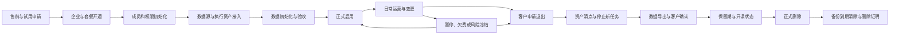

# 客户开通、运营变更与退出流程

更新日期：2026-08-07

## 一、为什么这不是一个“开通/删除”按钮

客户生命周期会同时改变企业、成员、权限、套餐、账号、广告账户、云登环境、Windows Agent、云手机、手机号、第三方密钥、内容、报表、文件、任务和审计记录。

因此必须把它设计成一条可暂停、可恢复、可验收、可审计的业务流程，而不是由管理员在多个页面手工配置，退出时再直接删除企业记录。

## 二、完整生命周期

## 三、开通阶段

### 1. 售前与试用确认

- 明确购买模块：AI 内容、投流数据、运营数据、内容审核发布、Edge 和设备能力。
- 明确交付模式：纯 SaaS、客户自带 Edge、托管运营或私有化。
- 记录成员、账号、广告账户、设备、存储、AI 用量和并发规模。
- 明确哪些数据源已经具备，哪些能力受小红书登录、云手机或第三方接口限制。
- 明确自动化风险、数据授权范围、数据保留期限和服务责任边界。

### 2. 企业初始化

- 创建企业、工作区、企业管理员和客户编号。
- 绑定套餐、试用期、配额、功能开关、数据保留策略和服务时间。
- 初始化角色和数据范围，默认最小权限，不自动授予全企业数据。
- 创建企业密钥空间、对象存储目录、任务队列配额和审计空间。
- 邀请必须有时效、单次使用，并记录邀请人和接受人。

### 3. 数据源与执行资产接入

- 接入小红书账号、专业号、广告账户，并使用稳定 ID 建立映射。
- 客户安装并注册 Windows Agent，Agent 只能领取本企业任务。
- 接入云登环境或云手机，检查账号登录状态、设备权限和版本。
- 手机号、SIM、验证码和二维码只绑定本企业，不允许跨企业复用。
- 第三方 API Key、Provider Key 和 Token 加密保存并完成连通测试。
- 每项资产都保存所有者、授权人、接入时间、状态和最近验证时间。

### 4. 初始化和上线验收

- 导入或同步约定历史数据，并生成数量、时间范围和缺失清单。
- 对投流数据执行源报表、事实表、聚合表和看板四层对账。
- 运营看板只有在云手机采集覆盖、每日增量、失败补采和互动数据均验收后，才能标记为“数据可用”。
- 使用测试任务验证 AI、工作流、采集、导出和发布等已购买模块。
- 客户和交付方共同确认验收单，记录未完成项、临时限制和责任人。
- 验收完成前企业处于“实施中”，不能把未验收模块标记为正式可用。

## 四、正式运营与变更

- 成员入职、离职、部门调整和负责人变更必须经过权限审批并留下审计记录。
- 小红书账号、广告账户、专业号、手机号、云登环境和设备更换时，只更新绑定关系，不覆盖历史归属。
- 套餐升级、降级、超额放行和并发调整记录生效时间，历史账单不被新配置改写。
- Token、Cookie、API Key 和设备凭证支持轮换、撤销和过期提醒。
- 客户可以查看本企业的数据截止时间、数据源健康、任务失败和配额使用。
- 高风险操作包括全量导出、批量删除、角色提权、密钥查看和自动发布启用，必须二次确认或审批。

## 五、暂停与冻结

暂停不等于删除，必须区分原因和影响范围：

| 状态 | 登录 | 查看历史 | 新建任务 | Worker/Agent 领取 | 数据同步 | 导出 |
|---|---|---|---|---|---|---|
| 正常 | 允许 | 允许 | 允许 | 允许 | 允许 | 按权限 |
| 超额限流 | 允许 | 允许 | 部分限制 | 限流 | 按套餐 | 按权限 |
| 欠费只读 | 允许 | 允许 | 禁止 | 禁止新任务 | 暂停 | 允许管理员导出 |
| 风险冻结 | 限制 | 按审批 | 禁止 | 立即停止 | 暂停 | 需审批 |
| 退出保留期 | 仅指定管理员 | 只读 | 禁止 | 禁止 | 停止 | 仅退出数据包 |
| 已删除 | 禁止 | 禁止 | 禁止 | 禁止 | 禁止 | 禁止 |

冻结时不能粗暴中断正在写数据库的任务。系统应先停止领取新任务，再让可安全完成的任务结束，对不能继续的任务记录停止原因和断点。

## 六、客户退出流程

### 1. 退出申请和身份确认

- 只有企业所有者或约定联系人可以发起退出。
- 二次验证申请人身份，记录退出原因、期望停止日期和数据处理选择。
- 明确未结账单、未完成任务、争议工单和法规要求，不能无提示直接删除。

### 2. 资产清点和停止服务

- 生成企业资产清单：成员、账号、广告账户、设备、密钥、内容、图片、任务、报表、日志和导出。
- 到达停止时间后禁止新任务，撤销会话、API Key、Webhook 和 Agent 领取权限。
- 取消未来排期任务；运行中任务按安全规则完成、取消或进入人工处理。
- 解除平台对客户云登、云手机、手机号和第三方数据源的访问权限。

### 3. 数据导出和客户验收

- 生成带版本、时间范围、数量、校验值和说明文件的退出数据包。
- 数据包至少覆盖成员与权限、内容与素材、工作流结果、任务、帖子、报表、映射关系和必要审计。
- 大文件通过限时签名地址下载，记录下载人、时间和结果。
- 客户确认数据包可读取且数量一致；失败可以在保留期内重新生成。

### 4. 保留期

- 企业进入只读状态，默认保留期限由合同或企业策略决定。
- 保留期内可处理账单、争议、重新导出和恢复申请，但不能继续业务任务。
- 到期前向客户管理员发送提醒，明确删除日期和不可恢复后果。
- 法律保留、争议冻结和正常保留必须分开标记，避免误删或无限期保留。

### 5. 正式删除和删除证明

- 删除业务数据库中的企业数据和企业对象存储文件，并撤销全部凭证。
- 多租户共享表必须按 `tenant_id` 精确删除，删除前后都要核对数量，不能执行无范围条件的删除。
- 审计记录按合同和法规进行脱敏保留或删除，不能由普通管理员决定。
- 备份中的数据按备份生命周期自然到期清除，记录预计彻底消失日期。
- 生成删除报告：删除范围、数量、执行时间、操作人、异常项、备份到期日和最终状态。

## 七、需要新增的数据对象

| 对象 | 用途 |
|---|---|
| `customer_lifecycle_cases` | 记录开通、变更、暂停和退出流程的主单 |
| `customer_lifecycle_steps` | 记录每个步骤、负责人、状态、证据和失败原因 |
| `tenant_entitlements` | 记录企业购买模块、功能开关、配额和生效区间 |
| `tenant_assets` | 统一登记账号、广告账户、设备、Agent、手机号和第三方连接 |
| `customer_acceptances` | 保存初始化数量、对账结果、限制项和双方确认 |
| `tenant_data_exports` | 记录数据包范围、文件、校验值、下载和过期时间 |
| `tenant_retention_policies` | 记录保留期、法律保留和备份到期策略 |
| `tenant_deletion_jobs` | 记录分表删除、文件删除、重试、核验和删除证明 |

## 八、任务拆分与验收

| ID | 任务 | 完成标准 | 优先级 |
|---|---|---|---|
| CL-01 | 定义产品模块、交付模式和责任边界 | 开通前能生成标准交付清单 | P0 |
| CL-02 | 建立客户生命周期主单和步骤状态机 | 开通、变更、暂停、退出均可暂停和恢复 | P1 |
| CL-03 | 建立企业初始化模板 | 企业、管理员、角色、配额和存储自动初始化 | P1 |
| CL-04 | 建立资产接入清单与健康检查 | 每项账号、Agent、设备和 Key 均有验证状态 | P1 |
| CL-05 | 建立历史数据初始化和对账验收 | 数据范围、缺失和差异有双方确认 | P1 |
| CL-06 | 建立正式启用门禁 | 未验收模块不能显示为正式可用 | P1 |
| CL-07 | 建立成员、资产和套餐变更流程 | 变更有审批、生效时间和历史版本 | P1 |
| CL-08 | 建立暂停、只读和风险冻结状态 | 不丢任务、不新增任务、权限符合状态矩阵 | P1 |
| CL-09 | 建立企业资产清点 | 退出前自动列出全部数据和外部连接 | P1 |
| CL-10 | 建立完整数据导出包 | 客户可核验数量、范围、格式和校验值 | P1 |
| CL-11 | 建立保留期和恢复机制 | 到期前可恢复，到期后自动进入删除 | P1 |
| CL-12 | 建立分阶段删除任务 | 数据库、对象存储、密钥和外部授权均可追踪 | P0 |
| CL-13 | 建立备份到期清除记录 | 能说明备份中数据最终清除时间 | P0 |
| CL-14 | 生成客户删除证明 | 可交付包含范围、数量和异常的正式报告 | P1 |

## 九、最终验收场景

使用一家测试企业完整演练一次：申请试用、初始化、接入账号和 Agent、导入数据、对账、正式启用、成员交接、套餐变更、暂停、恢复、申请退出、下载数据包、进入保留期、正式删除和备份到期记录。任何一步都能查到操作人、时间、状态、证据和失败原因，才算客户生命周期能力完成。
