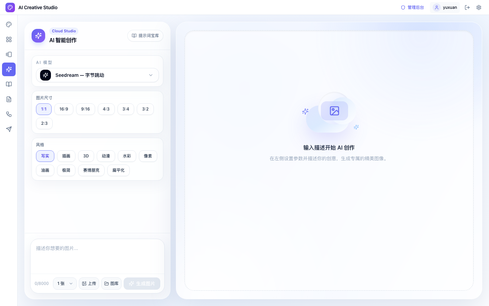
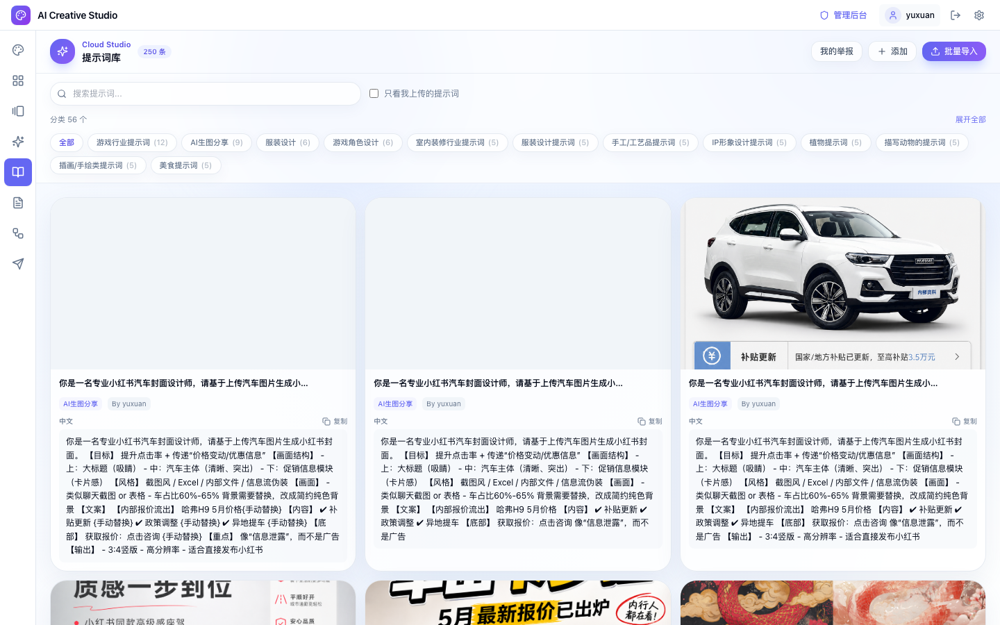
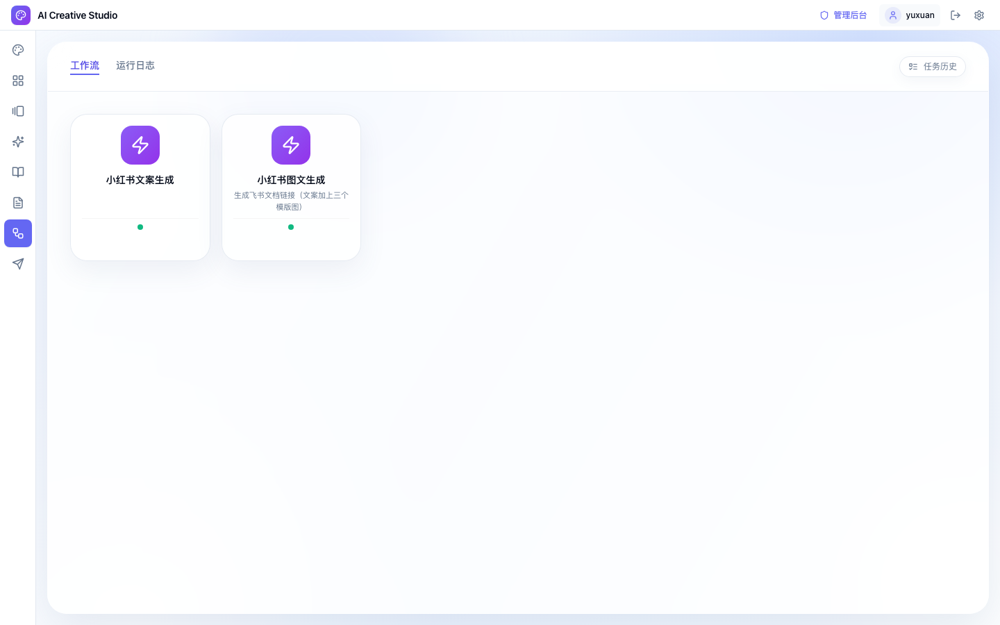
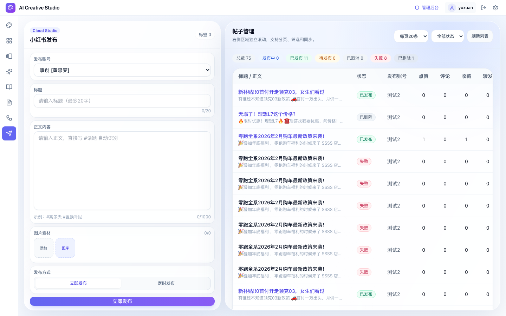
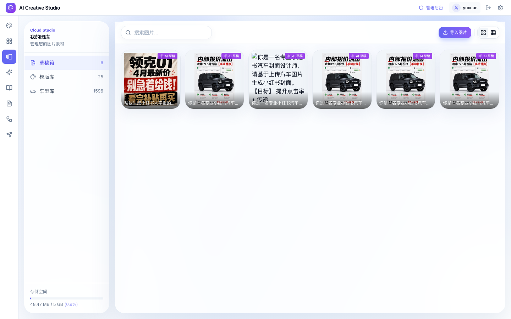

# 运营全链路说明（AI生图 → 工作流 → 自动发布）

> 适用对象：零基础运营同学  
> 使用目标：每天稳定产出图文内容，并完成发布与复盘  
> 更新时间：2026-05-12

---

## 1. 每天必走流程（30秒看懂）

1. 登录（没有账号找 @晏宇轩 开通）
2. AI 生图（优先 `seedream` 或 `gpt image 2`）
3. 工作流（文案生成 / 图文生成）
4. 左侧菜单进入 **发布管理**
5. 填写发布信息：**发布账号 → 标题 → 正文内容 → 图片素材**
6. 选择 **立即发布** 或 **定时发布**
7. 右侧 **帖子管理** 查看结果，按状态处理

---

## 2. AI 生图怎么用（重点）

### 2.1 先确定“生图来源”

1. 图库参考图：优先从 **我的图库** 选已有素材（公共数据里有汽车原图可复用）
2. 本地参考图：上传你手头图片作为参考
3. 文生图：仅用文字描述直接生成
4. 图生图：用参考图 + 提示词，做风格改造或场景变体

### 2.2 模型选择建议

1. `seedream`：出图快，适合高频日常产出
2. `gpt image 2`：细节好，适合重点内容和高质量封面

### 2.3 比例与平台规范（非常重要）

1. 小红书主流图文建议优先 `3:4`
2. 只有明确场景需要时再用 `1:1`、`9:16` 等比例
3. 一次任务内尽量固定比例，避免同篇笔记视觉不统一

### 2.4 提示词与结果沉淀

1. 图生得好：沉淀到“草稿/项目”或模板库，方便后续复用
2. 提示词好用：整理后分享到 **提示词库**，供团队学习
3. 没灵感：先去 **提示词库** 搜相近案例，再二次改写

### 2.5 AI 生图常见坑

1. 只改文案不改比例，导致平台展示效果差
2. 提示词太短，输出不稳定
3. 参考图质量太低，图生图结果会一起变差
4. 一次堆太多要求（风格/构图/文案/品牌词），容易失焦

---

## 3. 提示词库怎么用（灵感与标准化入口）

### 3.1 适用场景

1. 没灵感：按分类找可参考提示词
2. 想提效：复制成熟提示词做少量改写
3. 想沉淀：把验证有效的提示词回灌到团队库

### 3.2 使用建议

1. 先按业务场景筛选，再按关键词搜索
2. 复制后至少改 3 个核心要素：人群、场景、卖点
3. 不要原样长期复用同一条，避免内容同质化

---

## 4. 工作流怎么用（文案/图文批量化）

### 4.1 当前支持能力

1. 文案生成：标题、正文、话题等
2. 图文生成：按输入信息生成可发布内容组合

### 4.2 正确使用方式

1. 先准备稳定输入：车型、活动、人群、卖点、限制词
2. 运行后看 **任务历史** 与 **运行日志**
3. 结果不理想时，先改输入结构，再改提示词

### 4.3 注意点

1. 先跑小样，确认风格后再批量跑
2. 对“高风险描述”（价格/权益/政策）做人工复核
3. 保留 2~3 个优选版本，不要只留 1 个结果

---

## 5. 发布管理怎么用（落地发布）

### 5.1 左侧发布区（必填链路）

1. 发布账号：必须先选
2. 标题：必填，最多 20 字
3. 正文内容：必填，最多 1000 字，可写 `#话题`
4. 图片素材：至少 1 张
5. 发布方式：立即发布 / 定时发布

### 5.2 右侧帖子管理（结果处理）

1. `已发布`：可点“同步”拉最新互动数据
2. `待发布`：可“编辑 / 立即发布 / 取消”
3. `失败/已取消`：可“重新发布”回填左侧再提交

### 5.3 自动发布注意点

1. 定时发布时间需至少晚于当前 1 分钟
2. 定时前务必二次检查：账号、图片、标题、正文
3. 大批量发布建议分时段，不要所有内容同一时间触发

---

## 6. 图库怎么用（素材资产池）

### 6.1 你要做的事

1. 把可复用素材沉淀到图库，减少重复找图
2. 统一命名，方便后续搜索（如：车型_场景_日期）
3. 明确哪些素材是“公共可复用”，哪些是“临时活动素材”

### 6.2 与 AI 生图的关系

1. 图库是图生图参考源
2. AI 生图优秀结果可回存图库形成正循环

---

## 7. 一套可执行的日常 SOP（建议）

1. 先看提示词库，定今天主题和风格
2. 用 AI 生图出 6~12 张候选图（统一比例，优先 3:4）
3. 用工作流产出 3~5 版文案/图文组合
4. 人工挑选最优 2~3 组进入发布管理
5. 立即发布重点内容，定时发布次重点内容
6. 发布后 30~60 分钟做一次同步和状态复盘
7. 把优质图、优质提示词沉淀到图库/提示词库

---

## 8. 高优先级检查清单（发布前）

1. 比例是否符合平台（小红书优先 3:4）
2. 账号是否选对
3. 标题是否在 20 字以内
4. 正文是否有清晰利益点和话题标签
5. 图片是否清晰、无明显AI瑕疵
6. 定时时间是否正确
7. 是否已保留可复用资产（图 + 提示词）
