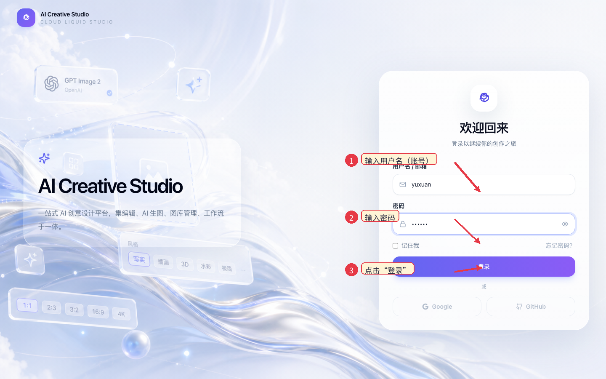
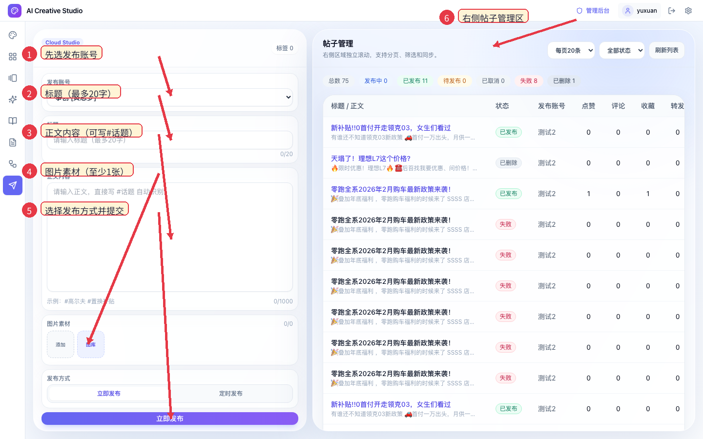
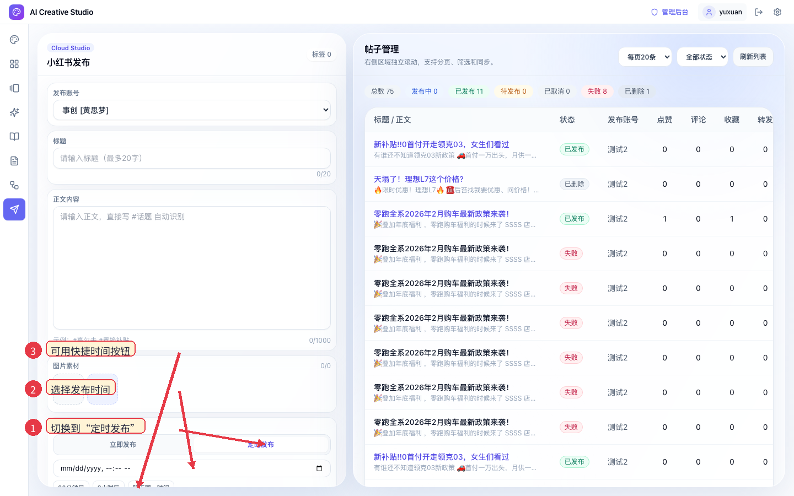

# 运营同学上手速查（发布管理）

> 适用对象：零基础运营同学  
> 系统：AI Creative Studio  
> 更新时间：2026-05-12

---

## 1. 每天必走流程（30秒看懂）

1. 登录系统（没有账号请找 @晏宇轩 开通）
功能说明：进入系统的唯一入口，未登录无法使用 AI 生图、工作流、发布管理。

2. AI 生图（优先选 `seedream` 或 `gpt image 2`）
功能说明：用于快速生成可发布图片素材，生成后可进入图库复用。

3. 工作流（文案生成 / 图文生成）
功能说明：批量或模板化生产内容，减少手动写文案时间；当前支持文案和图文两类。

4. 左侧菜单进入 **发布管理**
功能说明：进入小红书发布主工作台，左侧负责发帖，右侧负责管理结果。

5. 左侧填写发布信息：**发布账号 → 标题 → 正文内容 → 图片素材**
功能说明：这是发布必填链路，任一关键项缺失都会被拦截并提示。

6. 选择发布方式：**立即发布** 或 **定时发布**
功能说明：立即发布用于实时发帖；定时发布用于预约发布时间（至少晚于当前 1 分钟）。

7. 右侧 **帖子管理** 跟进结果并处理异常
功能说明：查看状态（发布中/已发布/待发布/失败等），并执行同步、编辑、取消、重新发布等操作。

---

## 2. 页面定位图（新手先看这里）

### 2.1 登录页

操作要点：
1. 用户名输入框：输入分配给你的账号
2. 密码输入框：输入密码
3. 点击 **登录** 进入系统

### 2.2 发布管理总览页

操作要点：
1. 先选 **发布账号**，不选会报错
2. **标题** 最多 20 字
3. **正文内容** 最多 1000 字，可直接写 `#话题` 自动识别标签
4. **图片素材** 至少 1 张（支持“添加”或“图库”）
5. 选发布方式后，点底部按钮提交
6. 右侧 **帖子管理** 用于查看状态和后续操作

### 2.3 定时发布页（展开后）

操作要点：
1. 点击 **定时发布** 切换模式
2. 选择具体发布时间
3. 也可以点快捷按钮：`30分钟后` / `2小时后` / `明天同一时间`

---

## 3. 左侧发布区怎么填（照着填就行）

## 3.1 发布账号

- 字段名：**发布账号**
- 规则：必须选择
- 常见报错：`请选择发布账号`

## 3.2 标题

- 字段名：**标题**
- 规则：必填，最多 20 字
- 常见报错：
  - `请输入标题`
  - `标题不能超过20字`

## 3.3 正文内容

- 字段名：**正文内容**
- 规则：必填，最多 1000 字
- 小技巧：正文里输入 `#高尔夫 #置换补贴` 会自动识别标签
- 常见报错：
  - `请输入正文内容`
  - `正文不能超过1000字`

## 3.4 图片素材

- 字段名：**图片素材**
- 规则：至少上传 1 张图片
- 两种方式：
  - **添加**：本地上传
  - **图库**：从系统图库选择
- 常见报错：`请至少上传一张图片`

## 3.5 发布方式

- **立即发布**：立刻提交执行
- **定时发布**：按指定时间执行
- 定时规则：时间必须至少晚于当前 1 分钟

---

## 4. 右侧帖子管理怎么用

## 4.1 先看状态

状态含义：
1. **发布中**：系统正在执行
2. **已发布**：发布成功
3. **待发布**：已创建定时任务，未到时间
4. **已取消**：任务被取消
5. **失败**：发布失败，可重试
6. **已删除**：帖子已删除或不可同步

## 4.2 常用按钮对照

1. **同步**（仅已发布）：拉取最新点赞/评论/收藏/转发
2. **编辑**（待发布）：修改标题、正文、发布时间
3. **立即发布**（待发布）：不等定时，马上执行
4. **取消**（待发布）：取消该定时任务
5. **重新发布**（失败/已取消）：把旧内容回填到左侧，再次提交

## 4.3 筛选和分页

1. 用右上角下拉筛选状态（例如只看失败）
2. 每页条数可切换 10/20/50
3. 点 **刷新列表** 获取最新状态

---

## 5. 日常操作模板（可直接照抄）

## 5.1 立即发布模板

1. 进入 **发布管理**
2. 选 **发布账号**
3. 填 **标题**、**正文内容**，并上传图片
4. 保持 **立即发布**
5. 点底部 **立即发布**
6. 右侧查看是否进入 `发布中/已发布`

## 5.2 定时发布模板

1. 前四步同上
2. 切到 **定时发布**
3. 选时间（或点快捷按钮）
4. 点 **创建定时发布**
5. 右侧筛选 `待发布`，确认任务存在

## 5.3 失败重发模板

1. 右侧筛选 `失败`
2. 点对应记录 **重新发布**
3. 系统会把旧内容带回左侧
4. 检查内容和图片后点 **立即发布**

---

## 6. 新手高频问题（FAQ）

1. 为什么点发布没反应？  
多数是字段没填完整，先检查账号/标题/正文/图片。

2. 定时时间选了但发布失败？  
定时必须至少晚于当前 1 分钟，太近会被拦截。

3. 已发布为什么数据没变化？  
点赞评论是平台实时数据，点 **同步** 更新即可。

4. 为什么看不到某条记录？  
先确认右上角状态筛选是否限制了结果，再点 **刷新列表**。

---

## 7. 术语对照（按页面原文）

1. 菜单：**发布管理**
2. 左侧卡片标题：**小红书发布**
3. 字段：**发布账号 / 标题 / 正文内容 / 图片素材 / 发布方式**
4. 发布方式：**立即发布 / 定时发布**
5. 右侧卡片标题：**帖子管理**
6. 操作按钮：**同步 / 编辑 / 立即发布 / 取消 / 重新发布 / 刷新列表**

